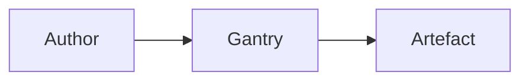

# User Guide

Gantry helps teams capture process information once and use it throughout a staged, gated process. This guide explains the engine's general concepts and uses the `design` definition as a worked example.

## Getting Started

To get Gantry running, clone the repository and run `npm install`, then start the server with `gantry serve`. See README.md for full setup instructions, including the prerequisites (Node.js, Pandoc and Git) and the corporate-proxy caveats.

Start at the **Workspaces** landing page. It shows the instances that Gantry knows about and is also where you create your first one.


Choose **+ New Workspace** to begin. By default this takes you straight into the **Local** flow — see **Local workspaces** below — with no remote-provider step at all. Turn on **Advanced mode** in **Settings** first if you need a Server-hosted Workspace instead; that adds a **Workspace location** choice, **Server-hosted** or **Local**, to the top of the wizard. With **Server-hosted** chosen, you can pick a workspace already registered with this Gantry server, or register a new one. Registering a new one starts by picking its **Provider** — see **Choosing a Provider** below — which decides which location fields come next (Organization/Project/Repository for Azure DevOps, Owner/Repository for GitHub) and which work-item fields the final step offers. Provide the location, the Workspace Owner, and a Personal Access Token that proves you can actually reach that repository — Gantry checks it before registering anything, and the PAT you typed becomes that workspace's own PAT once registration succeeds.

Next choose a Definition, such as `design`, then provide the Instance's name, directory and initial Assignee. The directory defaults from the name, but you can change it. If the Workspace's Provider tracks work items, the final step can link the Instance to a parent work item (a GitHub workspace's version of this step has no work-item-type field, since GitHub issues are untyped). A Local-workspace Instance (or a legacy local Instance) skips that step entirely — neither has a Provider.

### Choosing a Provider

A **Provider** is the external suite a Server-hosted Workspace's repo and work items both come from — **Azure DevOps** (Repos + Boards) and **GitHub** (repos + Issues) today, with **GitLab** (Projects + Issues, `gitlab.com` or self-hosted CE/EE) built at full parity alongside them; **Atlassian** is shown as a known-but-not-yet-available fourth option. A workspace picks exactly one Provider when it is registered, and everything about that workspace — its repository location, its Personal Access Token, its stage branches, its sign-off Pull/Merge Requests, its linked work items — runs through that one Provider from then on. There is no way to mix, for example, a GitHub repository with Azure DevOps work items.

Each Server-hosted Workspace holds its own **Workspace PAT** — there is no global or default token any more. The first request against a workspace with no PAT stored prompts for one, naming that workspace and its Provider so you always know which token to paste; the PAT you submit is stored only for that workspace, in this browser, and is never sent to any other workspace or Provider. Rotating or clearing a token in **Workspace Settings** (see **Settings** below) never affects any other workspace.

The permissions a Personal Access Token needs depend on the Provider:

- **Azure DevOps** needs **Code (Read & write)**, **Work Items (Read & write)** and **Identity (Read)** scope.
- **GitHub** needs a fine-grained token with **Contents**, **Issues** and **Pull requests** permissions set to Read & write, plus **Metadata** set to Read-only. Without all four, GitHub reports the repository itself as **not found** rather than as a permissions error — the same 404 a genuinely misspelled owner or repository name would produce. If a repository you know exists is reported as missing, check the token's permissions before assuming the location is wrong.
- **GitLab** needs a Personal, Project or Group Access Token carrying the **api** scope (or, as a narrower alternative, **read_repository** and **write_repository** together with API access to Issues and Merge Requests). As on GitHub, GitLab returns the same "not found" response for a Project that genuinely doesn't exist and for a token whose scopes don't reach it — check the token's scopes before assuming a namespace or project is misspelled.

A GitHub workspace can also point at a **GitHub Enterprise Server** host instead of the public `github.com`, and a GitLab workspace at a self-hosted **GitLab CE/EE** instance instead of `gitlab.com` — enter the base URL when registering, if your server administrator has enabled that option (it is off by default, the same SSRF protection an Azure DevOps Server base URL already has).

GitLab's own repo-equivalent is called a **Project**, held under a **Namespace** — GitLab's full group/subgroup path, however many levels deep, treated as one opaque string rather than split per level. Gantry stores it internally as `location.repository`, the same key GitHub's own location uses (a GitLab Project is structurally the same thing as a GitHub repository), but the wizard and Settings screens still label the field "Project" to a GitLab user.

GitLab's Merge Requests read a little differently from GitHub's Pull Requests when it comes to sign-off — see **Sign-off** under **Approval workflow** below for exactly how Gantry maps GitLab's approval toggle and discussion threads onto Gantry's own review states.

At the time of writing, GitLab's content store, stage branches, sign-off, work items, identity and Library repos (see **Settings** below) are all built and working — but registering a *brand-new* GitLab workspace isn't offered by the "+ New Workspace" wizard's Provider picker yet, so today a GitLab-backed workspace is added by adopting a Project that already holds instance data, rather than through the wizard's own Register step used for Azure DevOps and GitHub. A GitLab Library repo, by contrast, can already be added directly from **Settings**.

### Choosing a definition version

Each definition has numbered versions — each `draft` or `published` — with its own `CHANGELOG.md`. The New Workspace wizard lists every version for the chosen definition, shows the definition's description and the selected version's changelog underneath, and marks draft versions explicitly. Creating an instance from a draft version requires a confirmation step. Published versions are the default and are labelled "latest".


After creation, open the Instance from the landing page. Its header identifies the definition and current Stage. The stage controls let you browse the process, while each module is where you author the information that the process needs. Use the User Guide link in the header whenever you need to return to these concepts.

## Workspaces & Instances

A **Workspace** is where an Instance's data lives — shared storage for one or more Instances — and comes in two kinds: **Server-hosted**, either a repository on a **Provider** (Azure DevOps, GitHub or GitLab — see **Choosing a Provider** above) or a directory on the Gantry server itself, both registered with Gantry, or **Local**, a folder on your own machine picked in the browser (see **Local workspaces** below). For example, a team can keep several `design` initiatives in separate directories in one Server-hosted Workspace while retaining one repository history and access boundary.

An **Instance** is one run of a Definition against one initiative. It has its own module files, current Stage and Assignee. A `design` Instance might represent one system change; another `design` Instance can represent a different change in the same Workspace.

Instances can live in one of three places:

- A **local Instance** stores its files in the Gantry server's own `instances/` directory. It is useful for individual work or offline authoring.
- A **Workspace-backed Instance** stores its `instance.yaml` and modules inside a Server-hosted Workspace's repository on its Provider, under `gantry-workspace/<instance-slug>/`. Its changes are made on a Stage branch and reviewed through a Pull Request (a **Merge Request** on GitLab) on that Provider — Azure DevOps, GitHub or GitLab. The mechanics are the same either way; where they differ (how sign-off and review appear, and what a linked work item looks like) is called out in **Approval workflow** below.
- A **Local-workspace Instance** stores its files the same way, under `gantry-workspace/<instance-slug>/`, but inside a Local workspace's folder on your own machine rather than a Provider's repository — see **Local workspaces** below. It is a different thing from the local Instance above, even though both get called "local" in everyday speech: one lives on the machine running the Gantry server, the other lives on yours, and the server never sees it.

The storage choice changes how stage advancement and ticketing work, but not what a Module or Field means. All three kinds of Instance use the same Definition and the same authoring experience.

### Local workspaces

The **+ New Workspace** wizard's **Local** option is what creates a Local-workspace Instance. Choose **Local** as the Workspace location, then either **register** a new Local workspace in an empty folder or **pick** an existing one. This needs **Chrome or Edge** — it relies on a browser API (File System Access) that only those two support today; on another browser the wizard shows a clear message and keeps **Server-hosted** available instead.

By default the wizard skips the Workspace-location question altogether and takes you straight into this flow — you only see a choice between **Server-hosted** and **Local** once **Advanced mode** is turned on (see **Settings** below). With Advanced mode off, every Instance you create is a Local-workspace Instance.

**Registering** asks you to pick a new or empty folder, then name the workspace (an owner is optional) — Gantry writes a `workspace.json` marker at the folder's root so the folder is recognisable as a Gantry workspace later. **Picking** an existing one opens a folder that already has that marker and lists the Instances already inside it; a **Recent local workspaces** list remembers folders you've opened in this browser before, so you usually don't have to browse to them again. After a browser restart — or the first time in a different browser — the browser typically needs you to **Grant access** again before it will read or write the folder; that is a normal permission reset, not a sign anything is broken. The Workspaces landing page keeps its own **Local workspaces** panel for the same purpose, so you can often get straight back into one from there without opening the wizard at all.

Editing and saving modules works entirely offline — every change goes straight to the folder through the browser, with no server involved. Checking the gate and rendering an artefact both still need the Gantry server (rendering a `.docx` in particular happens there); if the server isn't reachable, those actions say so rather than failing silently. A rendered artefact is written straight into the folder's own `out/`, the same way a Workspace-backed Instance writes into its Provider's repository.

A Local-workspace Instance has no ticketing at all — no linked work item, no Review or Sign-off, no Stage branch or Pull Request. It advances the same way a local Instance does: once the current Stage's gate passes, use **Advance to next stage** to move it on yourself. See **Approval workflow** below.

### Numeric references

Every Workspace, Instance and Stage also carries a short numeric reference. Workspaces are numbered from 1 across the server; an Instance is numbered from 1 within its Workspace; a Stage's number is its position in the Instance's Definition, so Stage 1 is always the first Stage. Gantry shows these references on the Workspaces page and in the Instance header, and uses them as the canonical short form in links — for example `/instance/w2i1` opens the first Instance in Workspace 2, and `/instance/w2i1s3` opens that Instance's third Stage. A Workspace-only reference resolves to that Workspace's first Instance, and an Instance-only reference resolves to its first Stage. Older links that use an Instance's directory name still work.

### Dashboard PR status badge

On the Workspaces page, a Workspace-backed instance that has an open sign-off Pull Request shows a **PR OPEN** badge on its card. The badge reflects the persisted PR status — once the PR is completed or abandoned it disappears. Local instances never show a PR badge. Local-workspace instances are shown separately, in the landing page's own **Local workspaces** panel (see **Local workspaces** above) rather than as dashboard cards, so the badge doesn't apply to them either.

### Archive and restore

Workspaces and instances can be archived — hidden from the dashboard's default listing — and restored later, with no data deleted. Archiving is done from **Workspace Settings** or **Instance Settings** respectively. An archived instance still opens read-only at its direct `/instance/<slug>` link, with a banner explaining it is archived and linking to Instance Settings to restore it. On the dashboard, archived items appear in the collapsible **Archived instances** and **Archived workspaces** panels at the bottom of the page. A workspace that still has active instances cannot be archived until those are archived first. A definition can also be archived and restored from the Definitions page's switcher menu, filtered by a "Show archived" checkbox.

### Definition versions and the Definitions page

Definitions are versioned. The first version of a definition is published and is the default for new instances; newer versions start as `draft`. Each version has its own `definition.yaml`, module specs, templates and `CHANGELOG.md`. Only the latest published version is used when no explicit version is requested; draft versions are opt-in via the wizard's version picker.

The **Definitions** page — linked from the Workspaces page header — is a first-class editor for a definition's stages, artefacts, modules and fields. It switches between two navigation views over one focus pane: **Outline** (the default) lists Stages, Artefacts and Modules as three flat groups; **Map** lays the pipeline out spatially, stages as columns of module chips with each gate's artefacts hanging underneath. The choice is remembered per browser. In Map view, **Expand map** gives the Map the whole workbench so a large definition reads without scrolling: the focus pane and Library panel are hidden (an unsaved edit in them is kept), and picking something in the Map, or adding a new stage, artefact or module, brings them back; a copy from another definition lands in the expanded Map. That choice is remembered too. A docked **Library** panel on the right lists another definition's elements, which can be copied into a draft.


Click any stage, artefact or module to focus it in the centre pane. A module's fields are compact rows — click one to expand it, edit it, and collapse it again; only one field is expanded at a time. On a published version everything is read-only, with a **View template source** button to inspect each artefact's `.md.tmpl`; on a `draft` version every field is directly editable, and every element (Stage/Artefact/Module/Field — see CONTEXT.md's **Element**) can be reordered, or moved between a stage, an artefact and a module, either by dragging its handle or with an equivalent button (Move ↑/↓, "+ Add module…", "+ Add requirement…", "Move to module…"). The toolbar shows a live problems count — sharing the same validation rules the server runs on Save — that jumps straight to the affected element when clicked. Template editing opens as its own focus-pane view on a full markdown editor. Other actions: creating a **New draft version**, starting a **New definition** (Blank or cloned from the current one), **archiving / restoring** definitions, and **publishing** a draft (which validates it and flips its status to `published`). Save is a single action for everything changed since the last save, with a Save/Discard/Cancel prompt if you try to navigate away with unsaved changes.

### Example instances

The worked example throughout this guide remains the `design` definition, illustrated by the `examples` instance (a local instance with content for every stage).

## Stages & Gates

A **Stage** is an ordered phase of a Definition. It makes the relevant modules available for authoring and ends at one **Gate**.

A **Gate** is the decision point at the end of a Stage. A gate checks the artefact requirements declared by the Definition. Passing a gate permits the next action; it does not advance an Instance by itself. Local Instances — including Local-workspace Instances (see **Local workspaces** above) — advance explicitly, while Workspace-backed Instances advance when their approved Pull Request is merged.

For a Workspace-backed Instance the gate is checked as part of the Work Item Detail card's **Check status** action; a local Instance with a linked work item checks it with **Check gate & sync work item**. A Local-workspace Instance has no linked work item at all, so its gate is checked as part of **Advance to next stage** itself, with no separate check step. See *Approval workflow* for the full sequence.

A definition lists its stages, and the gate each one ends at, in its `definition.yaml`. The `design` definition, for instance, runs from initial shaping through high-level and detailed design to operational handover, each stage ending at its own gate.

## Modules & Fields

A **Module** is a self-contained area of process content and the source of truth for that content. A Module is made up of **Fields**, which are the individual prompts shown in the editor. A definition combines those fields into documents later, rather than asking authors to maintain separate copies in each document.

For example, one module might capture an initiative's context as separate fields — its driver, the opportunity, what is out of scope — and another might capture security considerations. A field is authored once and reused wherever an artefact needs it, never copied between documents. Each field can carry guidance and can be required only at the gate where it matters.

You normally work through the editor's Module cards and save as you go with the **Save** button at the top left of the toolbar. The available Modules depend on the current Stage, while an artefact's own requirements decide whether that artefact is complete. This lets one set of content support multiple outputs without duplicating authoring work.

### Field types

Most fields are free text (Markdown) or a bulleted list — you type the answer. Three more field types ask for a narrower kind of answer instead:

- A **select** field shows a dropdown of the answers the Definition author has decided are valid — a status, an outcome, a classification. Pick one from the list; there's no way to type something else. It opens with nothing chosen unless the Definition author set a **default** answer, in which case that option is pre-selected the first time you open the module — it still only counts as answered once you save, so an instance nobody has opened can't pass its gate on a default nobody actually chose. A select can also allow **several** answers at once, shown as tick-boxes instead of a dropdown — used where a question genuinely has more than one right answer, such as which pre-employment checks applied to a role.

  If a field already holds a value that isn't on the current option list — someone typed it before the field became a select, or the Definition's options changed since — Gantry keeps it rather than silently dropping it. It's shown as an extra, clearly marked entry so you can see it, and **check** (see *Stages & Gates* above) reports a warning so it doesn't go unnoticed. The gate still passes; it's a warning, not a block.

- A **text** field is a single line — a name, a short label — where a full Markdown field would be more than the answer needs.
- A **date** field is a calendar date, entered with your browser's own date picker rather than typed, so there's no ambiguity about the format. It's stored as `YYYY-MM-DD`; a rendered document that needs to read naturally ("3 November 2026") formats it for display without changing what's stored.

Which fields are which type is set by the Definition, not by you — an author can't turn a select into free text or the reverse from the editor. If a field's permitted answers look wrong or too narrow, that's a Definition change, made by whoever maintains it.

### The editor toolbar

Above the modules sits a view-mode bar. It starts with the **Save** button (a disk icon, see **Saving your work** below), then a **Mode ▾** dropdown switches every Markdown field between three views (see **Visual, Split and Markdown views** below); `Ctrl+Shift+V` cycles through them. Next to it is the **Artefact** selector, which appears when the current stage has artefacts with different field requirements; it filters the visible fields to only those the selected artefact needs, preserving drafts in hidden fields when you switch artefacts. On the right are **Clear all fields** and **Render**, and a **Review / Sign-off** shortcut that scrolls to the Work Item Detail card.


Each Markdown field has its own formatting toolbar (visible while the field has focus) with **Headings ▾**, bold, italic, inline code, link, lists, blockquote, image, table, **Undo** / **Redo** and full-screen controls. The **Table** button opens a size grid: hover to choose rows × columns, click to insert.

### Saving your work

The **Save** button saves every module on the stage that has changed, in one go; `Ctrl+S` (`⌘S` on a Mac) does the same. It is blue only while something differs from what is saved, and greyed out otherwise — undo back to the saved text and it greys out again. It briefly shows **Saving…** and **Saved**, or says what went wrong if a save fails, in which case it stays blue. After a save, each module card shows whether that module is complete or what is still outstanding.

If you have unsaved changes and switch stage, switch instance, follow a link in the header or press the browser's Back button, Gantry asks whether to **Save**, **Discard** or **Cancel**. **Render**, **Advance to next stage** and **Request Sign-off** ask the same question first, so they always work from your latest content. Closing or refreshing the tab shows the browser's own warning. Changing the view mode or the Artefact selector doesn't count as leaving.

On a Workspace-backed instance, on Azure DevOps, GitHub or GitLab alike, one Save is one commit on the stage's branch containing only the modules you changed. Saving doesn't re-render documents: they are rendered and committed only when you click **Render**, so render before requesting sign-off if the Pull Request should include up-to-date documents.

### Visual, Split and Markdown views

- **Visual** (the default) shows each field the way it will read — headings, bold and italic, code, quotes, links, images and Mermaid diagrams — and you edit it in place. The markdown markers under your caret stay visible on the line you are editing, so you can always see and correct them.
- **Split** puts the raw Markdown beside the Visual view of the same field. An edit in either side appears in the other, and the one formatting toolbar acts on whichever side you are working in.
- **Markdown** is the raw text, exactly as it is stored and as reviewers see it in the Pull Request.

All three edit the same text, so switching never changes your content: a field you open and save without editing is saved back byte for byte, and editing one table cell changes only that row. **Undo** and **Redo** (or `Ctrl+Z` / `Ctrl+Y`) cover every change in the field, whichever view you made it in. On an archived instance every view is read-only.

**Tables in Visual view** are real grids:

- Click anywhere in a cell to type in it; **Tab** and **Shift+Tab** move between cells, and **Tab** from the last cell adds a new row. **Esc** leaves the table.
- Hover the top edge of a table for a handle above each column. Click a handle for **Insert column left / right**, **Cycle alignment** and **Delete column**; drag it sideways to move the column.
- Hover the left edge for a handle beside each row: click for **Insert row above / below** and **Delete row**, or drag it up or down to move the row. The header row can't be dragged; deleting it makes the next row the header.
- The small handle in the top-left corner selects the whole table and offers **Delete table**.

Columns share the table's width evenly: Markdown has nowhere to store a column width, so there is no resizing. A run of pipe lines that isn't a well-formed table (for example, rows with different numbers of cells) stays plain text. In **Markdown** view, a strip of table buttons appears above the toolbar while the caret is inside a table.

To the right of the Artefact selector, a **Navigation ▾** dropdown jumps to any module or section heading in the current stage — useful in stages with many fields. It lists every module title and each field heading in document order.

Use **Insert ▾** below each field to add a new **Section** (a custom Markdown block) or **List** below that field. Custom sections appear as new fields with their own headings and are saved with the module.

### Adding images

To put a picture or diagram into a field, place the cursor where it should go and use the **Image** button on that field's formatting toolbar (see **The editor toolbar** above). This opens a dialog with two tabs:

- **Upload new** — choose an image file (PNG or JPEG), optionally give it a name, and provide its **Source location**: a link to where the original file lives, such as a Draw.io diagram or an export from a design tool. The source location is required — it's what lets anyone reading the finished document trace a picture back to where it came from — and Gantry shows that link as a small citation beneath the image wherever it's used.
- **Choose existing** — reuse a picture already uploaded elsewhere in the same instance instead of uploading it again.

Either way, Gantry inserts the reference into the field for you at the cursor.

For a Workspace-backed Instance (see **Workspaces & Instances** above), images work a little differently: uploading through the editor isn't available, since a picture needs to be committed to the Provider's repository the same way everything else about the instance is. Instead, add the image file straight to the instance's own `assets` folder in the repository (alongside its `modules` folder), then reference it from a field yourself, the same way you would reference any other image, for example ``. Gantry resolves it the same way in both Visual view and rendered documents, on Azure DevOps, GitHub or GitLab, and a rendered artefact's source citation and provenance footer link to the right commit on whichever Provider the instance uses.

### Drawing diagrams with Mermaid

For a diagram you would rather write than draw, put a fenced `mermaid` block in the field:

````markdown

````

Visual view draws the diagram in place of the source; use its **Edit diagram text** button to change the source in a pop-over. When you **Render** with the default WASM Pandoc engine, the Word document carries the diagram as a picture, and the Markdown file written beside it keeps the Mermaid source so it stays editable. If Mermaid cannot parse a block, Visual view keeps the source and shows a short error note under it; the rest of the field and the render are unaffected.

Two things to know: the **Native Pandoc** engine (and the `gantry render` command) still export the block as source text, and HTML markup inside labels is not supported — use plain text.

## Artefacts & Rendering

An **Artefact** is a rendered output such as a summary, design document or handover document. Artefacts are generated from module data on demand and are never the authored source of truth.

Each artefact declares the module or field content it `requires`. Those requirements determine whether that artefact is complete for its gate. Multiple artefacts can therefore render different views of the same modules without asking authors to duplicate content.

A definition lists its artefacts in `definition.yaml`, each with the gate it renders at and the module or field content it `requires`. One definition can declare several artefacts over the same modules — a short summary and a fuller specification, say — without duplicating any authored content.

### Rendering

Use the **Render** button in the view-mode bar to open the Render dialog. It lists every artefact the current stage can produce — the same dialog whether the stage has one artefact or several sharing a gate.


Toggle the artefacts you want, then press **Render**. Gantry renders each selected artefact in sequence and reports the output path (and, for Workspace-backed instances, the Provider URL) in the dialog. For a Workspace-backed instance the rendered `.docx` is pushed to `gantry-workspace/<instance>/out/` in the repository; for a local instance it appears under `instances/<slug>/out/`; for a Local-workspace instance it is written straight into that same `gantry-workspace/<instance>/out/` path, but inside your own folder rather than a repository.

### Document Control and Review & sign-off tables

Straight under its title, a rendered document normally has two tables, both supplied by Gantry. **Document Control** gives the version, the render date, the commit the render was saved as, and the gate's status. **Review & sign-off** lists the stage's reviews and sign-offs, or shows `Pending` if there are none yet. You never fill these in yourself; they come from the instance's history and its pull request.

Some documents are written for people outside the organisation, such as the offer sent to a candidate. For those, both tables are internal detail you would otherwise delete by hand. A Definition author can switch them off for one artefact: untick **Document Control** on that artefact on the Definitions page, or set `document-control: false` on it in `definition.yaml`. That artefact then renders with its title and content only, and neither table. Every other artefact keeps both tables. This applies wherever the document is rendered: locally, on any Provider, in the browser, from the command line, or automatically when you request sign-off. The commit the render was saved as is still in the repository's history, even though the document doesn't print it.

The key accepts only `true` or `false`. Anything else, such as `"no"` (which is also what an unquoted `no` becomes), is a problem. `gantry validate` and a Local Workspace report it, the Definitions page marks it on a draft, and it blocks Save and Publish. A Definition that carries it won't load until it's fixed, and neither will its instances, on any Provider. Until then the other Definitions in the same folder stop listing too. The error names the artefact and the value. A Definition can still leave the tables out of every document at once by shipping an empty `templates/_documentControl.md.tmpl`.

### How a rendered document gets its name

By default a rendered document is named `<Instance name> - <Artefact title>` — for example `Senior Platform Engineer - Offer Pack.docx`. That's fine while the document stays inside its instance folder, but once it's downloaded, emailed or filed alongside documents from other systems, a name built only from the instance and the artefact stops telling anyone what's actually in it.

A Definition author can give an artefact a **filename pattern** instead — a short template drawing on the instance's own content, for example `{selection.candidate-name} - Offer Pack - {contract.start-date}`, which renders as `Jane Smith - Offer Pack - 2026-11-03.docx`. This is a Definition-authoring concern, not something you set per instance — as the person filling in fields, the only thing you notice is that the document you download is already named after the person and the date it's about, with nothing to rename by hand afterwards.

A couple of things worth knowing if a filename looks different from what you expected:

- If a field the pattern uses is still blank — you're rendering a draft partway through a stage — that part of the name simply drops out, tidied up so you don't get stray dashes or spaces. Once you fill the field in and render again, the name catches up.
- A pattern can include the date of the render itself, or the value of a field you go on to correct — a candidate's name, a start date that moves. Re-rendering after either kind of change can produce a different filename from the one already in `out/`, and at the time of writing the earlier file is not automatically removed — check the output folder after a name-affecting change and remove a superseded document yourself if it's no longer wanted.

## Approval workflow

A gate passing permits the next action; it does not advance an Instance by itself.

For a local Instance, such as a local run of the `design` Definition, use **Advance to next stage** once the current gate has passed. Clicking it re-checks the gate and, if it passes, opens a confirmation dialog — confirm to move the Instance on to its next Stage, or decline to leave it where it is. A local Instance with a linked work item also keeps a separate **Check gate & sync work item** button, which re-checks the current gate and, if it passes, offers to push a state update to that work item. A Local-workspace Instance (see **Local workspaces** above) works the same way but has no linked work item and so no separate check button — **Advance to next stage** is the only action needed.

For a Workspace-backed Instance, such as a `design` initiative stored on Azure DevOps, GitHub or GitLab, everything to do with review and sign-off happens in the **Work Item Detail card** at the top of the Stage screen. There is no separate section further down the page. The card behaves the same way whichever Provider the workspace uses; the differences in what each Provider shows you are called out where they arise below.

### The Work Item Detail card

The card shows this Stage's synced fields — work item type, title, status, assignee and parent work item — alongside its Reviews, its Sign-off Pull Request and its commit history. You edit the title and assignee in place; clearing an override restores the inherited value.

The card's header holds **Show files** (when a workspace is linked), **Show commit history** and the single **Check status** button. The **Reviews** section header holds **Request Review** and the **Sign-off** section header holds **Request Sign-off** — there are no separate sign-off or review panels further down the page.


### Check status

One **Check status** button at the top of the card refreshes everything in a single click: the linked and parent work items, every review request for the Stage, and the sign-off Pull Request. For a Workspace-backed Instance the same click then runs the gate-check-and-sync step — if the current Stage's gate passes and a work item is linked, Gantry offers to push a state update to it. When the sign-off Pull Request has been approved, this is also the click that merges it, advances the Instance and updates the linked work item.

### Reviews

Use **Request Review** in the Reviews section header to ask one or more people to look at the Stage before sign-off. Each request is tracked as its own work item — on Azure DevOps that's a work item per reviewer, and on GitHub and GitLab alike it's an issue per reviewer, even though a GitHub or GitLab issue could technically take several assignees at once: keeping one issue per reviewer is what lets Gantry show "Ana approved, Sam wants changes" as two separate statuses rather than one ambiguous one. Each request shows the reviewer's name. Reviews refresh from the card's **Check status** button, not per row. Once a Stage has more than two reviews, Gantry groups them by outcome — pending, changes requested and approved — so it is easy to see what still needs attention.

On GitHub and GitLab alike, a review's status rides a `gantry:review/<status>` label on its issue — the same vocabulary and slugs on both, since it's one Gantry-owned convention layered onto two Providers' issues, not a per-Provider naming choice. Gantry creates these labels the first time it needs them, so there is nothing to set up on the repository or project first. You can see and filter by them directly in GitHub's or GitLab's own issue list if you want to. (On GitLab, assignment happens by numeric user id rather than by username, since GitLab's Issues API has no assign-by-username field the way GitHub's does — this is invisible in the UI, Gantry looks the person up for you either way.)

### Sign-off

Use **Request Sign-off** in the Sign-off section header after the gate has passed. Gantry opens that Stage's Pull Request (a **Merge Request** on GitLab) into `main` and records the Owner as the reviewer. The Owner reviews and approves it on the workspace's Provider — Azure DevOps, GitHub or GitLab — using that Provider's own review UI; you then return to Gantry and choose **Check status**. A rejection, a request for changes, or an approval invalidated by later commits on the branch must be resolved before sign-off can complete.

On GitHub specifically: an **Approved** or **Changes requested** review maps directly to Gantry's own sign-off states, while a plain comment or a dismissed review reads as still pending, the same way an absent review does — only a real verdict counts. Gantry always merges an approved sign-off Pull Request with a merge commit; if GitHub's branch protection or a required check refuses the merge, Gantry reports that refusal to you exactly as GitHub gave it, and does not retry with a different merge method — the block is resolved on GitHub, not worked around by Gantry.

On GitLab specifically: GitLab's Merge Requests have no separate "changes requested" review verb on Free/CE, only an Approve/unapprove toggle kept apart from discussion-thread resolution — Gantry reads *not approved with an unresolved discussion thread* as the changes-requested equivalent, and *not approved with no unresolved thread* as still pending, the same way an absent review does. On a GitLab Premium/Ultimate project with enforced Approval Rules configured, Gantry honours those instead; elsewhere it falls back to the toggle-plus-threads reading above. As with GitHub, a merge that GitLab's own branch protection or a required approval refuses is reported to you exactly as GitLab gave it, not retried with a different method.

The linked work item is a tracking surface, not the approval mechanism. The Pull Request is what gates a Workspace-backed Stage, and there is no separate in-app Request Approval button — the sign-off flow is the approval mechanism.

### Review and sign-off status

Each review and sign-off item carries a Gantry status — Requested, In review, Changes requested, Approved or Rejected. On Azure DevOps this is kept separate from the native work item state, which continues to drive the board — if a project has not been set up with the custom status field, Gantry falls back to reading the native state instead, so the card still shows a sensible status. On GitHub and GitLab alike, the same five-value status is what the `gantry:review/<status>` label above carries, read straight from the issue.

### Commit history

Use **Show commit history** in the card header to open a dialog listing the commits on the current Stage's branch. This works before a Pull Request exists, so you can see what has been committed to the Stage while it is still in progress.

## Settings

Gantry's Settings are split by scope:

- **Global Settings** holds the **Advanced mode** toggle, off by default — with it off, a browser only ever sees the Local workspace flow (see **Local workspaces** above), with no Provider, work-item or sign-off UI anywhere in the app. It also holds a **default ticketing system** choice, which only ever affects a *new* Azure DevOps Workspace's own ticketing-system override (Jira is listed but disabled). There is no global Personal Access Token here, or anywhere else: every Server-hosted Workspace holds its own **Workspace PAT** (see **Choosing a Provider** above), so this screen has nothing credential-related to set.
- **Workspace Settings** controls the Owner and the Workspace's own PAT — set it, replace it, or clear it, entirely independently of every other workspace's own token — plus, for an Azure DevOps workspace only, a ticketing-system override (Jira is listed but disabled; a GitHub or GitLab workspace has no such choice, since its tracker is fixed by its Provider — GitHub Issues or GitLab Issues respectively). This screen also shows the Workspace's Provider and, at a glance, whether its PAT is set, missing or was rejected on the last request that used it. These settings apply to the Workspace and can be opened from an Instance that belongs to it. The same screen also holds **Archive workspace** / **Restore workspace**.
- **Instance Settings** controls the Instance's Assignee and shows read-only information about the Instance and its linked work item. The same screen also holds **Archive instance** / **Restore instance**. An archived instance is hidden from the dashboard but still opens at its direct URL.

An override narrows the scope of a setting: a workspace's own PAT and ticketing-system choice apply only to that Workspace, while Instance settings affect only that one run of the Definition — nothing here falls back to a shared default any more.

For example, an architect can give a GitHub `design` Workspace its own PAT while a separate Azure DevOps `design` Workspace keeps its own, entirely unrelated token, and assign one `design` Instance without changing its Workspace or sibling Instances.

## Definition Reference Guide

This section is for architects who already know the organisation's reference documents and want to know where each part of them lives in Gantry. There is one guide per definition; each maps the definition's reference documents heading-by-heading onto Gantry stages, modules and fields, and shows which fields are shared across stages.

### Contoso Solution Design

The `design` definition (version 2) reproduces six Contoso design documents from one set of authored content. Content is introduced once and carried forward: a field is authored at the stage where it is first needed, re-opened — never re-typed — at every later stage that needs it, and rendered into whichever documents call for it.

The six documents, the reference each one reproduces, and the stage that produces them:

| Document | Reference document | Produced at stage (gate) |
| --- | --- | --- |
| Solution on a Page (SOAP) | SAMPLE SOAP (Mobile Phone Assistance) — Confluence export | SOAP (`business-case`) |
| Full Solution on a Page (Full SOAP) | JEDI Full SOAP Template | SOAP (`business-case`) |
| High Level Design (HLD) | 2026 TAC Architecture High Level Solution Design Template | High-level Design (`hld-arb-approved`) |
| Solution Architecture Document (SAD) | SAD Template | Detailed Design (`build-ready-checklist`) |
| Solution Support Architecture Document (SSAD) | FV Help Tool SSAD (a filled instance, not a blank template) | Detailed Design (`build-ready-checklist`) |
| As-built | ATLAS – Migration Infrastructure Design – Approved (a filled instance) | Operational Handover (`operational-handover`) |

The rendered documents are deliberately **not** a one-to-one copy of every reference heading. Three decisions shape every table below:

- **Shared modules, not per-document sections.** Scope, assumptions, NFRs, risks, security, dependencies, the glossary, the recovery plan and the security-control register are each one module reused by several documents. A reference heading that appears in two documents maps to one field.
- **Consolidation over sprawl.** Where a reference document has a chapter of viewpoints or a deep product-specific hierarchy (the SAD's Logical Components View, the SSAD's thirty product sub-sections, the ATLAS's fifty-five infrastructure headings), Gantry gives it one field. Put the finer structure inside the field as sub-headings when an instance needs it; a module per heading would mostly sit empty.
- **Document control is the tool's job.** Version, date, commit, gate status and the review / sign-off table are rendered at the top of every document by Gantry from the instance's history and pull request — not authored as fields. Where a reference has a Document Control, Approved By, Consulted or Sign-Off section, that is what it maps to.

#### How to read the tables

- **Reference heading** — every heading in the reference document, at every level, in the reference's own order. `H1`/`H2`/`H3` is the level in the source document. A row marked *(gantry-only)* is a section Gantry renders that the reference does not have.
- **Where to find it in Gantry** — the module and field as they are titled in the editor (Module › Field), the field id in code for anyone reading the definition or an instance's module files, and the heading it renders under in the document.
- **Description / rationale** — what the field holds, and why the mapping is what it is when it is not a plain match.

Stage abbreviations used below: **SOAP** — the SOAP stage; **HLD** — High-level Design; **DD** — Detailed Design; **Handover** — Operational Handover. Every field in a table is authored at that document's own stage unless the row says it is *carried* from an earlier one.

#### Solution on a Page (SOAP)

Reference: *SAMPLE SOAP (Mobile Phone Assistance)*, a Confluence export. All fields are authored at the SOAP stage.

| Reference heading | Where to find it in Gantry | Description / rationale |
| --- | --- | --- |
| `H1` SAMPLE SOAP (Mobile Phone Assistance) *(page title)* | Document title `<instance>: Solution on a Page`, followed by the Document Control and Review & sign-off tables | The title is the instance name. The two control tables are Gantry-only headers on every document; the Confluence page had none. |
| `H1` Background and context | Background and context › Problem statement `background.problem` → `# Background and context` / `## Problem statement`; › Affected domains `background.affected-domains` → `## Affected domains` | The reference writes this as one prose block. Gantry splits it into two headed fields so each can be gated and reused: Problem statement is the same field the HLD renders as "Current state" — write it once here, deepen it for the ARB. |
| `H1` Solution definition | Solution Definition module → `# Solution definition` | Same section. Gantry opens it with a `## High-level requirements` (`solution-definition.high-level-requirements`) the sample does not have: it is the agreed requirement set that the SAD's Requirements traceability later maps back to. |
| `H2` Process flow | Solution Definition › Process flow `solution-definition.process-flow` → `## Process flow` | Match. Re-rendered in the SAD's Solution overview, so write the SOAP-level flow once. |
| `H2` High level solution design | Solution Definition › High level solution overview `solution-definition.high-level-solution-overview` → `## High-level solution design` | Same content. The editor title uses the Full SOAP's wording because one field feeds both SOAPs and opens the HLD's Proposed solution; the rendered heading keeps this reference's wording. |
| `H2` Assumptions and considerations | Design Basis › Assumptions `design-basis.assumptions` → `## Assumptions and considerations` *(only when filled)* | Assumptions live in the cross-stage Design Basis module so they are entered once at SOAP and refined through to handover rather than re-typed at each stage. Optional here, as in the sample. |
| `H2` Feature breakdown and involved teams | Solution Definition › Feature breakdown and involved teams `solution-definition.feature-breakdown` → `## Feature breakdown and involved teams` | Match. |
| `H1` Teams, contact persons, and high-level estimates | Teams, contact persons, and high-level estimates › Teams required `team-and-estimates.teams-required` → `## Teams and contact persons`; › Estimates `team-and-estimates.estimates` → `## High-level estimates` | The reference is a single table. Gantry keeps the team list and the sizing as two fields so the Full SOAP and the HLD's cost-benefit / delivery approach can reuse each on its own. Rendered sub-headings keep this reference's wording; editor titles use the Full SOAP's. |
| `H3` References: | Teams, contact persons, and high-level estimates › References `team-and-estimates.references` → `## References` *(only when filled)* | Match; promoted from a note under the table to a section of its own. Reused by the Full SOAP, SAD and SSAD. |

#### Full Solution on a Page (Full SOAP)

Reference: *JEDI Full SOAP Template*. All fields are authored at the SOAP stage. The Full SOAP and the SOAP share the same modules; the Full SOAP simply renders more of them.

| Reference heading | Where to find it in Gantry | Description / rationale |
| --- | --- | --- |
| Metadata block: Epic/Project · Requested/lead by · Request date · Draft agreed date · SOAP/estimate delivered date | Full SOAP Details › the five matching fields `soap-full-details.epic-project` … `.delivered-date` → `# Metadata` table | The reference's front-matter table, reproduced as a table. Only the Full SOAP uses these fields. |
| `H1` Introduction | Overview › Overview `introduction.overview` *(optional)* → `# Introduction` / `## Overview` | The reference opens with an Introduction that had no field in version 1. Version 2 wires in the shared Overview field, so the same text later opens the SAD and the As-built. |
| `H2` Problem statement | Background and context › Problem statement `background.problem` → `## Problem statement` | Same field as the SOAP's Problem statement and the HLD's Current state. |
| `H1` Opportunity | Background and context › Opportunity `background.opportunity` → `# Opportunity` | The Full SOAP is where this is first asked for; the HLD renders the same field as "Desired future state". |
| `H1` In Scope | Overview › In scope `introduction.in-scope` → `# In scope` | The canonical scope statement. Entered here and re-opened — not re-typed — at HLD, SAD, SSAD and As-built. |
| `H1` Out of Scope | Overview › Out of scope `introduction.out-of-scope` → `# Out of scope` | As above. Silence on out-of-scope is the most common reason a design is sent back with questions. |
| *(gantry-only)* `# Design basis` | Design Basis › Assumptions `design-basis.assumptions`, › Constraints `design-basis.constraints` *(both optional)* → `# Design basis` / `## Assumptions` / `## Constraints` | A deliberate departure from the reference's order: the reference places Assumptions after Dependencies, Gantry renders the Design Basis block straight after scope in every document so the cross-stage backbone reads the same everywhere. This is where the reference's "Assumptions" section (below) lands. |
| `H1` High Level Requirements | Solution Definition › High-level requirements `solution-definition.high-level-requirements` → `# High level requirements` | Match. |
| `H1` High level solution overview | Solution Definition › High level solution overview `solution-definition.high-level-solution-overview` → `# High level solution overview`; › Alternatives sketch `solution-definition.alternatives-sketch` *(optional)* → `## Alternatives sketch` | Match. The Alternatives sketch is a Gantry addition: a brief note of what else was considered, which seeds the HLD's Alternatives considered. |
| `H1` Teams required | Teams, contact persons, and high-level estimates › Teams required `team-and-estimates.teams-required` → `# Teams required` | Match. |
| `H1` Dependencies | Dependencies › Dependencies `dependencies.dependencies-overview` → `# Dependencies` | Match. One narrative field carried to the HLD and the SAD, where the structured Dependency list is added. |
| `H1` Assumptions | Design Basis › Assumptions — rendered earlier, under `# Design basis` | Same content, different position (see the Design basis row). Only rendered when filled. |
| `H1` Estimates | Teams, contact persons, and high-level estimates › Estimates `team-and-estimates.estimates` → `# Estimates` | Match. The HLD's cost-benefit and delivery approach refine these rather than restate them. |
| `H1` Sequencing | Full SOAP Details › Sequencing `soap-full-details.sequencing` → `# Sequencing`, preceded by the reference's fixed "possible example" note | Match. |
| `H1` Questions | Open Questions › Open questions `open-questions.questions` → `# Questions` | Version 2 merged the Full SOAP's own questions field into the shared Open Questions module: a question raised at SOAP is the same question the ARB sees in the HLD's Open questions. |
| `H1` Caveats | Full SOAP Details › Caveats `soap-full-details.caveats` → `# Caveats` | Defaults to the JEDI template's eight standing caveats; edit only if an initiative needs to vary one. These qualify the *estimate*; caveats about the *design* belong in Design Basis › Caveats. |
| `H1` References | Teams, contact persons, and high-level estimates › References `team-and-estimates.references` → `# References` | Match. Mandatory here, optional on the lightweight SOAP. |

#### High Level Design (HLD)

Reference: *2026 TAC Architecture High Level Solution Design Template*. All fields are authored at the HLD stage unless marked carried. The reference's cover is a table of rows, not headings; Gantry turns it into a headed `# Submission` section so it is navigable.

| Reference heading | Where to find it in Gantry | Description / rationale |
| --- | --- | --- |
| Cover: `H3` [Insert month and year] · `H1` [Insert paper title – as per the agenda] | Document title `<instance>: High Level Design`; date and version in the Document Control table | Title and date come from the instance and the render, not from fields. |
| Cover row: Purpose | HLD Submission › Purpose statement `hld-submission.purpose-statement` → the opening paragraph of `# Submission` (no heading of its own) | On the cover the purpose is a one-line statement above the table; Gantry keeps it as the section's intro paragraph. |
| Cover rows: Author · Contributors | HLD Submission › Authors and contributors `hld-submission.authors-and-contributors` *(optional)* → `## Authors and contributors` | Both cover rows in one list of name and role. |
| Cover row: Technical Architecture Committee are requested to: Endorse / Approve / Discuss / Note | HLD Submission › Decision requested `hld-submission.decision-requested` → `## Decision requested` | Match. |
| Cover row: Consultation | HLD Submission › Consultation `hld-submission.consultation` → `## Consultation` | Match. |
| `H3` Next Steps | HLD Submission › Next steps `hld-submission.next-steps` *(optional)* → `## Next steps` under `# Submission` | Same text. The reference's detached cover heading is grouped with the rest of the submission metadata rather than floating before the body. |
| `H2` Problem Statement | `# Problem statement`, built from the Background and context and Overview modules | Same section; sub-sections follow. |
| `H3` Current state | Background and context › Problem statement `background.problem` *(carried from SOAP)* → `## Current state` | The SOAP's Problem statement re-opened, pre-filled. Deepen it for an ARB reader; do not re-derive it. |
| `H3` Desired future state | Background and context › Opportunity `background.opportunity` → `## Desired future state` | Same field as the Full SOAP's Opportunity. Required at this gate. |
| `H3` In scope / out of scope | Overview › In scope `introduction.in-scope` → `## In scope`; › Out of scope `introduction.out-of-scope` → `## Out of scope` | The shared scope backbone, pre-filled from a Full SOAP if one was produced. Two headings rather than one so each half is gated separately. |
| `H3` Success criteria | Background and context › Success criteria `background.success-criteria` → `## Success criteria` | Match. |
| `H3` Non-functional requirements | Non-Functional Requirements › Performance `nfrs.performance`, › Availability and continuity `nfrs.availability-and-continuity` *(both mandatory at this gate)* → one `## Non-functional requirements` | The reference has one section and makes it mandatory. Only the two headline NFRs are asked for at the ARB gate, at headline depth; the rest of the module — scalability, disaster recovery, other NFRs, requirements traceability — is completed at Detailed Design and does not appear in the HLD form or document. |
| `H2` Proposed solution | `# Proposed solution`, opening with Proposed Solution › Guardrails `proposed-solution.guardrails` as the intro paragraph | Guardrails are prose in the reference too ("note the applicable guardrail(s)…"), so they have no heading. |
| `H3` Alignment with strategy | Proposed Solution › Alignment with strategy `proposed-solution.strategy-alignment` → `## Alignment with strategy` | Match. Show how the SOAP shape aligns with strategy; do not restate the shape. |
| `H3` Dependencies | Dependencies › Dependencies `dependencies.dependencies-overview` *(carried from SOAP)* → `## Dependencies` | Same narrative field as the Full SOAP. The structured Dependency list is a Detailed Design concern and is not asked for here. |
| `H3` Implications | Proposed Solution › Implications `proposed-solution.implications` *(optional)* → `## Implications` | Match. |
| `H3` Trade-offs | Proposed Solution › Trade-offs `proposed-solution.trade-offs` → `## Trade-offs` | Match. |
| `H3` Risks and mitigations | Risks › Risks and mitigations `risks.risk-register` → `## Risks and mitigations` | Match. The same register is completed at Detailed Design; at HLD, include the risks that bear on the decision. Open issues are a Detailed Design concern and are not asked for here. |
| `H3` Security and privacy | Security › Privacy and confidentiality concerns `security.privacy-and-confidentiality` *(mandatory at this gate)* → one `## Security and privacy` | The reference has one section. Only privacy is asked for at the ARB gate — enough to judge whether a security assessment is needed; the rest of the posture (security architecture, identity and access, regulations and standards) is completed at Detailed Design and does not appear in the HLD form or document. |
| `H3` Cost-benefit analysis | Proposed Solution › Cost-benefit analysis `proposed-solution.cost-benefit` → `## Cost-benefit analysis` | Match. Start from the SOAP estimates. |
| `H3` Delivery approach and indicative timeline | Proposed Solution › Delivery approach and indicative timeline `proposed-solution.delivery-approach` → `## Delivery approach and indicative timeline` | Match. Refine the SOAP T-shirt sizes into a timeline. |
| `H2` Alternatives considered | Alternatives considered › Alternatives `alternatives-considered.alternatives` → `# Alternatives considered` | One field for all alternatives. Seeded by the Full SOAP's Alternatives sketch. |
| `H3` Alternative 1 · `H3` Do nothing | Author each alternative as a `###` sub-heading inside the Alternatives field | The reference's headings are placeholders showing the expected shape, not fixed sections. "Do nothing" is worth including explicitly. |
| `H2` Open questions | Open Questions › Open questions `open-questions.questions` *(optional, carried from SOAP)* → `# Open questions` | Same field as the Full SOAP's Questions. |
| `H2` Attachment/s | HLD Submission › Attachments `hld-submission.attachments` *(optional)* → `# Attachment/s`, rendered last | Match. Edited alongside the other submission fields; rendered at the end like the reference. |

#### Solution Architecture Document (SAD)

Reference: *SAD Template* (98 headings). All fields are authored at the Detailed Design stage unless marked carried. Version 2 re-sequenced the document to the reference's own reading order; the biggest consolidations are the Business Architecture and Logical Components viewpoint chapters, which each become a small number of fields.

| Reference heading | Where to find it in Gantry | Description / rationale |
| --- | --- | --- |
| `H1` Executive Summary | Overview › Executive summary `introduction.executive-summary` *(optional)* → `## Executive summary` under `# Overview` | Added in version 2; the SAD and SSAD both open with one. Distinct from Overview, which introduces the subject rather than summarising the document. |
| `H1` Introduction | `# Overview` (Overview module) | The reference has two opening chapters — Introduction and Overview — with overlapping purposes. Gantry renders one. |
| `H2` Document Purpose | Overview › Purpose `introduction.purpose` → `## Purpose` | Match (the reference's Overview › Purpose is the same field). |
| `H2` Background | Overview › Overview `introduction.overview` → `## Overview` | Background and Context both fold into the single Overview narrative, pre-filled if it was written at SOAP. |
| `H1` Tables & Figures | Not modelled | Word generates it; the rendered `.docx` carries its own. |
| `H1` Overview | `# Overview` | Merged with Introduction (see above). |
| `H2` Purpose | Overview › Purpose `introduction.purpose` | As Document Purpose. |
| `H2` Context | Overview › Overview `introduction.overview`, and Architecture › Business context `architecture.business-context` → `## Business context` under `# Business architecture` | The plain-language context lives in Overview; the business-process and regulatory setting that builders need lives in Business context. |
| `H2` Solution Scope | Overview › In scope `introduction.in-scope` → `## In scope`; › Out of scope `introduction.out-of-scope` → `## Out of scope` *(carried from SOAP/HLD)* | The cross-stage scope backbone. |
| `H3` In Scope | Overview › In scope | Match. |
| `H3` Out of Scope | Overview › Out of scope | Match. |
| `H3` Stakeholder Mapping | Support and Operations › Stakeholders and support contacts `support-and-operations.stakeholders` *(optional here)* → `## Stakeholders` under `# Business architecture` | Shared with the SSAD, where it is mandatory. Version 2 wired it into the SAD at the reference's position. |
| `H1` Business Architecture View | `# Business architecture` | The reference's viewpoint chapter condenses to two sub-sections (Stakeholders, Business context). A full viewpoint tree would be modules most instances leave empty. |
| `H2` Business Concept View | Architecture › Business context `architecture.business-context` | Write the concept view as part of the Business context narrative. |
| `H2` Business Process | Solution Definition › Process flow `solution-definition.process-flow` *(optional here, carried from SOAP)* → `## Process flow` under `# Solution overview` | The SOAP-stage process flow re-opened; deepen it rather than re-describe it. |
| `H3` Solution Users | Architecture › Solution users `architecture.solution-users` *(optional, list)* → `## Solution users` | Added in version 2 for the reference's User / Description table. Business roles only — security roles are under Identity and access management. |
| `H3` Acts & Regulations | Security › Regulations and standards `security.regulations-and-standards` → `## Regulations and standards` under `# Security` | Regulations are held once, with the security posture, rather than in two chapters. |
| `H3` Wider Government Context | Architecture › Business context | Part of the Business context narrative. |
| `H2` Relevant Functional Requirements | Solution Definition › High-level requirements `solution-definition.high-level-requirements` *(optional here, carried from SOAP)* → `## High-level requirements` under `# Solution overview` | The agreed SOAP requirement set, carried forward. The detailed functional requirements are a separate artefact outside this definition. |
| `H2` Non-Functional Requirements | Non-Functional Requirements module → rendered under `# Operating considerations` (and `# Requirements traceability`) | The reference states NFRs twice (here and in Operating Considerations). Gantry renders them once, where the detail sits. |
| `H1` Solution Overview | `# Solution overview`, opened by Architecture › Solution description | Same chapter. It also carries the High Level Architectural View content (rows below) so the architecture reads in one place. |
| `H2` Dependencies | Dependencies › Dependencies `dependencies.dependencies-overview` *(carried from SOAP/HLD)* → `## Dependencies overview`; › Dependency list `dependencies.dependency-list` → `## Dependency list` | The overview is pre-filled; the structured list is new at this gate. Version 2 moved both to the reference's early position. |
| `H1` High Level Architectural View | Continues `# Solution overview` (Design decisions → Applicable standards) | Merged into Solution overview; the sub-sections keep the reference's order. |
| `H2` Design Decisions | Architecture › Design decisions `architecture.design-decisions` → `## Design decisions` | Match. Deepen the SOAP sketch to build-ready depth. |
| `H2` Architectural Risks | Architecture › Architectural risks `architecture.architectural-risks` → `## Architectural risks` | Match. Structural risks only; delivery and operating risks are in the Risks module. |
| `H2` Solution Description | Architecture › Solution description `architecture.solution-description` → `## Solution description` | Match. Expands the SOAP overview and process flow. |
| `H2` Architectural Goals | Architecture › Constraints and goals `architecture.constraints` → `## Constraints and goals` | Goals and constraints are one short passage in practice; three headed sections would mostly be empty. |
| `H2` Architectural Constraints | Architecture › Constraints and goals | As above — architecture-specific limits only. |
| `H2` Architectural Assumptions | Design Basis › Assumptions `design-basis.assumptions` *(optional, carried from SOAP/HLD)* → `## Assumptions` under `# Design basis` | Solution-wide assumptions live in the cross-stage Design Basis. Anything specific to the architecture's shape goes in Constraints and goals. |
| `H2` Solution Standards | Architecture › Applicable standards `architecture.standards` *(list)* → `## Applicable standards` | One list covers solution and architectural standards. |
| `H2` Architectural Standards | Architecture › Applicable standards | As above. |
| `H1` Open Issues | Risks › Open issues `risks.open-issues` *(carried from HLD)* → `# Open issues` | Version 2 gave it the reference's own top-level position. It is followed by a gantry-only `# Risks` / `## Risk register` (`risks.risk-register`) — the register carried from the HLD, which the reference has no chapter for. |
| `H1` Logical Components View | Architecture › Logical components `architecture.logical-components` *(list)* → `# Logical components view` | One list of components, each marked new or existing. The four viewpoints below are a Word navigation device, not separate content. |
| `H2` Layered Viewpoint | Architecture › Logical components — add a sub-heading inside the field if the viewpoint is needed | Collapsed into the component list. |
| `H2` Product Viewpoint | Architecture › Logical components | As above. |
| `H2` Application Usage Viewpoint | Architecture › Logical components | As above. |
| `H2` Service Realisation Viewpoint | Architecture › Logical components | As above. |
| `H2` Logical Existing Components | Architecture › Logical components — mark each item existing | Same list. |
| `H2` Logical New Components | Architecture › Logical components — mark each item new | Same list. |
| `H1` Requirements Realisation | Non-Functional Requirements › Requirements traceability `nfrs.requirements-traceability` → `# Requirements traceability` | Realisation and traceability are one mapping back to the SOAP requirement set. |
| `H1` Requirements Traceability | Non-Functional Requirements › Requirements traceability | Match. |
| `H2` Compliance with Requirements | Non-Functional Requirements › Requirements traceability — map against Solution Definition › High-level requirements | Same field. |
| `H2` Compliance with Non Functional Requirements | Non-Functional Requirements › Requirements traceability — map against the NFR fields | Same field. |
| `H1` Technology Architecture View | `# Technology architecture` (Integration module) | Same chapter. It opens with a gantry-only `## Interfaces` (`integration.interfaces`), the integration points themselves, which the reference has no heading for. |
| `H2` Network Architecture | Integration › Network and infrastructure architecture `integration.network-and-infrastructure` → `## Network and infrastructure architecture` | Network, infrastructure and hosting are one umbrella narrative; the Deployment View details have their own fields. |
| `H2` Infrastructure Architecture | Integration › Network and infrastructure architecture | As above. |
| `H2` Hosting & Sites | Integration › Network and infrastructure architecture | Folded into the umbrella narrative by decision. |
| `H1` Deployment View | `## Deployment view` under `# Technology architecture` *(rendered only when one of its fields is filled)* | Kept as a sub-section of Technology architecture rather than its own chapter. |
| `H2` Application Software View | Integration › Software and licences `integration.software-and-licences` *(optional)* → `## Software and licences` | Added in version 2: software, version, count and licences per environment. |
| `H2` Infrastructure View | Integration › Network and infrastructure architecture | Same narrative as Network Architecture. |
| `H2` Hardware | Integration › Hardware `integration.hardware` *(optional)* → `### Hardware` | Match. |
| `H2` Bandwidth | Integration › Bandwidth `integration.bandwidth` *(optional)* → `### Bandwidth` | Match. |
| `H2` Network Devices | Integration › Network Devices `integration.network-devices` *(optional)* → `### Network devices` | Match. |
| `H2` Communication & Network Protocols | Integration › Communication & Network Protocols `integration.communication-and-network-protocols` *(optional)* → `### Communication and network protocols` | Match. |
| `H2` SAN (Database, Application Server, Backup, DR) | Integration › SAN (Database, Application Server, Backup, DR) `integration.san` *(optional)* → `### SAN (Database, Application Server, Backup, DR)` | Match. |
| `H1` Failure & Recovery | `# Failure and recovery` (Recovery Plan module + Non-Functional Requirements › Disaster recovery and backup) | Same chapter. Version 2 moved it before the Information view, as in the reference. |
| `H2` DR, Backup & Archiving | Split across the two sub-sections below | The reference's grouping heading. |
| `H3` Disaster Recovery | Recovery Plan › Recovery approach `recovery-plan.recovery-approach` → `## Recovery approach`; › Resiliency, › Test scenarios, › RACI *(optional)* → their own `##` | The failover *mechanism*. Shared with the As-built, where it is re-opened rather than re-written. |
| `H3` Backup & Archiving Policy | Non-Functional Requirements › Disaster recovery and backup `nfrs.disaster-recovery-and-backup` *(carried from HLD)* → `## Backup and archiving policy` | The recovery *targets*: RTO/RPO, backup schedule and retention. Started at HLD, completed here, pulled through to the As-built. |
| `H1` Information View | `# Information view` (Data module) | Same chapter. |
| `H2` Information Structure View | Data › Logical data model `data.logical-data-model` → `## Logical data model` | Different name, same content. |
| `H2` Data Classification | Data › Data classification `data.data-classification` → `## Data classification` | Match. Shared with the SSAD. |
| `H2` Data Replication | Data › Data replication `data.data-replication` → `## Data replication` | Match. |
| `H2` Data Storage Archiving & Retention | Data › Data retention, archiving and records management `data.data-retention-and-archiving` → `## Data retention, archiving and records management` | Retention and records management are authored together. |
| `H2` Data Migration | Data › Data migration `data.data-migration` → `## Data migration` | Match. |
| `H2` Records Management | Data › Data retention, archiving and records management | Merged (see Data Storage Archiving & Retention). |
| `H2` Environments | Support and Operations › Environments, URLs and domains `support-and-operations.environments-and-domains` → `# Environments, URLs and domains` | Version 2 merged the SAD's environment list with the SSAD's, so one list serves both documents. |
| `H1` Security View | `# Security` (Security + Data Security Controls modules) | Same chapter. |
| `H2` Identity & Access Management | Security › Identity and access management `security.identity-and-access` → `## Identity and access management` | Carries IAM, security roles, authentication and user roles in one field. |
| `H2` Security Roles | Security › Identity and access management | Merged. |
| `H2` Authentication | Security › Identity and access management | Merged. |
| `H2` User Roles | Security › Identity and access management (security roles); Architecture › Solution users for the business user catalogue | Merged. |
| `H2` Security Architecture | Security › Security architecture `security.security-architecture` → `## Security architecture` | Carries its own goals, constraints and assumptions (the three `H3`s below). |
| `H3` Security Architecture Goals | Security › Security architecture | Merged. |
| `H3` Security Architecture Constraints | Security › Security architecture | Merged. |
| `H3` Security Assumptions | Security › Security architecture | Merged. |
| `H3` Regulations & Standards | Security › Regulations and standards `security.regulations-and-standards` *(list)* → `## Regulations and standards` | Match. |
| `H3` Privacy & Confidentiality Concerns | Security › Privacy and confidentiality concerns `security.privacy-and-confidentiality` *(carried from HLD)* → `## Privacy and confidentiality concerns` | Match. |
| `H3` Security Concerns | Data Security Controls › Controls `data-security-controls.controls` → `## Security concerns`; › Inheritance and dependencies *(optional)* → `## Security control inheritance and dependencies` | The concrete control register (encryption, networking, access management…), shared with the SSAD and re-opened for the As-built. Kept separate from the design-time posture above. |
| `H1` Operating Considerations | `# Operating considerations` | Same chapter. Version 2 moved the NFR detail here to match. |
| `H2` Terms & Conditions and Contracts | Support and Operations › Operational accounts and licenses `support-and-operations.operational-accounts-and-licenses` *(optional)* → `## Operational accounts and licenses`, rendered at the end of `# Security` | The accounts, subscriptions and contracts a support team must hold. Shared with the SSAD. |
| `H2` Scalability | Non-Functional Requirements › Scalability and capacity `nfrs.scalability-and-capacity` → `## Scalability and capacity` | Scalability and capacity are one field. |
| `H2` Performance | Non-Functional Requirements › Performance `nfrs.performance` *(carried from HLD)* → `## Performance` | Match. Headline set at HLD, testable figures here. |
| `H2` Capacity | Non-Functional Requirements › Scalability and capacity | Merged. |
| `H2` Continuity | Non-Functional Requirements › Availability and continuity `nfrs.availability-and-continuity` *(carried from HLD)* → `## Availability and continuity` | Availability and continuity are one field. |
| `H2` Availability | Non-Functional Requirements › Availability and continuity | Merged. |
| `H2` Systems Management & Monitoring | Support and Operations › Monitoring and alerting `support-and-operations.monitoring-and-alerting` *(optional)* → `## Monitoring and alerting` | Shared with the SSAD, where it is mandatory. |
| `H2` Future Considerations | Non-Functional Requirements › Other non-functional requirements `nfrs.other-nfrs` → `## Other non-functional requirements` | Folded. |
| `H2` Decommission | Support and Operations › Decommission `support-and-operations.decommission` *(optional)* → `## Decommission` | Added in version 2: end of life is an operational commitment, not a quality attribute. |
| *(gantry-only)* `# Operational readiness` | Support and Operations › Support handover readiness `support-and-operations.support-handover-readiness` → `# Operational readiness` | The SAD carries only the handover summary; full support detail is the SSAD's job. |
| `H1` Glossary | Glossary › Terms and definitions `glossary.terms-and-definitions` → `# Glossary` | Match. Shared with the SSAD and As-built. |
| `H1` Document Control | Document Control table at the top of the document | Not a field: version, date, commit and gate status come from the instance's history. |
| `H2` Version History | Document Control table and the instance's commit history | As above. |
| `H2` Template Information | Definition version, shown in Instance Settings | As above. |
| `H2` Approved By | Review & sign-off table (pull-request sign-off) | As above. |
| `H2` Consulted | Review & sign-off table (review requests) | As above. |
| `H2` Distribution | Not modelled | Handled outside the document. |
| `H2` References | Teams, contact persons, and high-level estimates › References `team-and-estimates.references` *(optional, carried from SOAP)* → `# References` | Reuses the SOAP's references list. |
| `H1` Appendix | Not modelled, by decision | Attach supporting material to the work item; the As-built has its own Appendix field. |

#### Solution Support Architecture Document (SSAD)

Reference: *FV Help Tool SSAD* — a filled instance for one product family, not a blank template, so most of its headings are product names. All fields are authored at the Detailed Design stage; the SSAD is a second rendering of the same design data as the SAD, focused on what a support team needs.

| Reference heading | Where to find it in Gantry | Description / rationale |
| --- | --- | --- |
| `H1` Executive Summary | Overview › Executive summary `introduction.executive-summary` *(optional)* → `## Executive summary` under `# Overview` | Added in version 2. Same field as the SAD's. |
| `H1` Document Control | Document Control table at the top of the document | Tool-supplied, not a field. |
| `H2` Revision History | Document Control table and the instance's commit history | As above. |
| `H2` Sign-Off | Review & sign-off table (pull-request sign-off) | As above. |
| `H1` Solution Products | Architecture › Logical components `architecture.logical-components` *(list)* → `# Logical components`, opening the document | The reference's product catalogue is the component list. Version 2 moved it to the front to match. |
| `H2` Are You OK | An item in Logical components | Product names from the FV instance; the template is generic. |
| `H2` Service Finder Tool | An item in Logical components | As above. |
| `H2` In Your Hands | An item in Logical components | As above. |
| `H2` Change is Possible | An item in Logical components | As above. |
| `H2` Change is Possible Community Forum | An item in Logical components | As above. |
| `H1` Architectural Risks | Architecture › Architectural risks `architecture.architectural-risks` → `# Architectural risks`; then Risks › Risks and mitigations `risks.risk-register` → `# Risks` / `## Risk register` and › Open issues `risks.open-issues` → `## Open issues` | Structural risks, then the register carried from the HLD. |
| `H1` Introduction | `# Overview` (Overview module) | Same section, named for the module. |
| `H2` Purpose | Overview › Purpose `introduction.purpose` → `## Purpose` | Shared with the SAD. |
| `H2` Scope | Overview › In scope `introduction.in-scope` → `## In scope`; › Out of scope `introduction.out-of-scope` → `## Out of scope` | The scope backbone. |
| `H2` Content Standards | Overview › Content standards `introduction.content-standards` *(optional)* → `## Content standards` | Only the SSAD renders this field — conventions a reader needs (diagram provenance, notation, relation to the SAD). |
| `H1` Solution Overview | `# Solution overview`, opened by Architecture › Solution description `architecture.solution-description` → `## Solution description` | The reference's thirty product sub-sections are abstracted to the generic support fields below. Product-specific detail is written as sub-headings inside those fields. |
| `H2` Stakeholders | Support and Operations › Stakeholders and support contacts `support-and-operations.stakeholders` *(list)* → `## Stakeholders and support contacts` | Stakeholders and the support map are one list with the escalation path. |
| `H2` Solution Domains | Support and Operations › Environments, URLs and domains `support-and-operations.environments-and-domains` *(list)* → `## Environments, URLs and domains` | Domains, URLs and environments are one list, shared with the SAD. |
| `H2` Whakarongorau | Dependencies › Dependency list `dependencies.dependency-list` → `## Dependency list`; the integration itself in Integration › Interfaces | Third-party services are dependencies and interfaces, not sections. |
| `H2` Mailchimp | Dependencies › Dependency list; Support and Operations › Operational accounts and licenses if an account is held | As above. |
| `H2` AWS | Dependencies › Dependency list; hosting detail belongs in the SAD's Technology architecture | As above. |
| `H2` Support Map | Support and Operations › Stakeholders and support contacts | Merged with Stakeholders (support tiers and escalation). |
| `H2` URL’s, Domains and redirections | Support and Operations › Environments, URLs and domains | Match, in generic wording. |
| `H2` Service Finder Tool Environments | Support and Operations › Environments, URLs and domains | Match. |
| `H2` Solution Context Model | Architecture › Solution description `architecture.solution-description` | Describe the context model here; embed the diagram in the field. |
| `H2` Widget | Architecture › Solution description or › Logical components — as a sub-heading | Component-level detail inside the generic fields. |
| `H2` Public zone | Architecture › Solution description — as a sub-heading | As above. |
| `H2` Web hosting | Architecture › Solution description — as a sub-heading | As above. |
| `H2` Web hosting diagram | Architecture › Solution description — embed the image | As above. |
| `H2` Search API | Integration › Interfaces `integration.interfaces` → `## Interfaces` | An integration point. |
| `H2` Search API diagram | Integration › Interfaces — embed the image | As above. |
| `H2` Ingest process | Integration › Interfaces | As above. |
| `H2` Ingest process diagram | Integration › Interfaces — embed the image | As above. |
| `H2` Solution Components | Architecture › Logical components | Same list as Solution Products. |
| `H2` Media Viewing in RUOK, CiP and IYH | Architecture › Solution description or Integration › Interfaces | Product-specific behaviour. |
| `H2` AWS Partner Licences | Support and Operations › Operational accounts and licenses `support-and-operations.operational-accounts-and-licenses` *(list)* → `## Operational accounts and licenses` | Licences are one list. |
| `H2` Silverstripe Security | Data Security Controls › Controls `data-security-controls.controls` → `## Security concerns` | Version 2 removed the SSAD's separate operational-security field: product security notes are rows in the control register, shared with the SAD. |
| `H2` OWASP | Data Security Controls › Controls (and Security › Regulations and standards in the SAD) | As above. |
| `H2` Spotify Embed | Integration › Interfaces | An integration point. |
| `H2` Somar Licenses – Operational | Support and Operations › Operational accounts and licenses | As AWS Partner Licences. |
| `H2` Security | Data Security Controls › Controls; Security › Identity and access management `security.identity-and-access` → `## Identity and access management`; › Privacy and confidentiality concerns `security.privacy-and-confidentiality` → `## Privacy and confidentiality concerns` | Design-time posture (Security module, carried from HLD) and the concrete controls (Data Security Controls) are two layers, both rendered here. |
| `H2` Healthpoint API flow | Integration › Interfaces | An integration point. |
| `H2` Release Procedures | Support and Operations › Release procedures `support-and-operations.release-procedures` → `## Release procedures` | Match. Version 2 moved it late, as in the reference. |
| `H2` Whakarongorau *(second occurrence)* | Dependencies › Dependency list; Integration › Interfaces | As the first. |
| `H2` Google Maps Integration | Integration › Interfaces | An integration point. |
| `H1` Glossary | Glossary › Terms and definitions `glossary.terms-and-definitions` → `# Glossary` | Match. |
| `H1` References | Teams, contact persons, and high-level estimates › References `team-and-estimates.references` *(optional, carried from SOAP)* → `# References` | Version 2 wired the shared references list in. |
| *(gantry-only)* `## Data classification` · `## Availability and continuity` · `## Disaster recovery and backup` · `## Scalability and capacity` · `## Monitoring and alerting` · `## Support handover readiness` | Data › Data classification; Non-Functional Requirements › Availability and continuity, › Disaster recovery and backup, › Scalability and capacity; Support and Operations › Monitoring and alerting, › Support handover readiness | The reference scatters these concerns across its product sections. Gantry gives the support team one place for each, under `# Solution overview`. |

#### As-built

Reference: *ATLAS – Migration Infrastructure Design – Approved* — a filled, approved design for one migration, so its lower headings are that migration's services. Fields are authored at the Operational Handover stage; the Overview, Design Basis, Glossary, Recovery Plan and Data Security Controls content is carried from Detailed Design and re-opened, not re-typed.

| Reference heading | Where to find it in Gantry | Description / rationale |
| --- | --- | --- |
| `H1` Table of Contents | Not modelled | Word generates it. |
| `H1` Terms & Definitions | Glossary › Terms and definitions `glossary.terms-and-definitions` *(carried)* → `# Terms & Definitions` | Match. |
| `H1` Introduction | `# Overview` (Overview module, carried) | Named for the module. |
| `H2` Overview | Overview › Overview `introduction.overview` → `## Overview` | Match. |
| `H2` Purpose | Overview › Purpose `introduction.purpose` → `## Purpose` | Match. |
| `H2` Scope | Overview › In scope and › Out of scope | The scope backbone. |
| `H3` In Scope | Overview › In scope `introduction.in-scope` → `## In scope` | Match. |
| `H3` Out of Scope | Overview › Out of scope `introduction.out-of-scope` → `## Out of scope` | Match. |
| `H2` Constraints | Design Basis › Constraints `design-basis.constraints` *(optional)* → `## Constraints` under `# Design basis` | Match; carried from SOAP onward. |
| `H2` Assumptions | Design Basis › Assumptions `design-basis.assumptions` *(optional)* → `## Assumptions` | Match. |
| `H2` Caveats | Design Basis › Caveats `design-basis.caveats` *(optional)* → `## Caveats` | Match. |
| `H2` Design Principals | Design Basis › Design principles `design-basis.design-principles` *(optional)* → `## Design principles` | Match; the reference's spelling is corrected. |
| `H2` Outcomes / Deliverables | Design Basis › Outcomes and deliverables `design-basis.outcomes-and-deliverables` *(optional)* → `## Outcomes and deliverables` | Match. |
| `H1` Migration Infrastructure Design | `# As-built design` (As-Built Notes module) | The ATLAS's product chapter becomes the generic as-built design chapter. |
| `H2` Overview | As-Built Notes › Design overview `as-built-notes.design-overview` → `## As-built overview` | Renamed so the document does not carry two "Overview" headings. |
| `H2` Architecture Decisions | As-Built Notes › Architecture decisions `as-built-notes.architecture-decisions` *(optional)* → `## Architecture decisions` | Match. |
| `H2` Data Migration Flows | As-Built Notes › Data migration and process flows `as-built-notes.process-flows` → `## Data migration and process flows` | The twelve flow headings below are authored inside this one field, as sub-headings. |
| `H3` Migration Approach | As-Built Notes › Data migration and process flows — sub-heading | Instance-specific flow. |
| `H3` Migration Infrastructure Flows | As-Built Notes › Data migration and process flows — sub-heading | As above. |
| `H3` Consultant Flows | As-Built Notes › Data migration and process flows — sub-heading | As above. |
| `H4` ShareGate Flow | As-Built Notes › Data migration and process flows — sub-heading | As above. |
| `H4` Door Server (VM) Flow | As-Built Notes › Data migration and process flows — sub-heading | As above. |
| `H4` Migration Server (VM) Flow | As-Built Notes › Data migration and process flows — sub-heading | As above. |
| `H4` Bastion | As-Built Notes › Data migration and process flows — sub-heading | As above. |
| `H3` Data Extraction Flows | As-Built Notes › Data migration and process flows — sub-heading | As above. |
| `H4` From Migration VM | As-Built Notes › Data migration and process flows — sub-heading | As above. |
| `H4` From Objective Document Store | As-Built Notes › Data migration and process flows — sub-heading | As above. |
| `H4` From Migration VM *(second occurrence)* | As-Built Notes › Data migration and process flows — sub-heading | As above. |
| `H3` Document Load into SharePoint Online | As-Built Notes › Data migration and process flows — sub-heading | As above. |
| `H4` From ShareGate VM | As-Built Notes › Data migration and process flows — sub-heading | As above. |
| `H2` Migration Services | As-Built Notes › Infrastructure and configuration `as-built-notes.infrastructure-and-configuration` → `## Infrastructure and configuration` | The fifty-five service headings below are authored inside this one field. A module per service would fit exactly one instance. |
| `H3` On-Premises Services | As-Built Notes › Infrastructure and configuration — sub-heading | Instance-specific service. |
| `H4` Objective Servers | As-Built Notes › Infrastructure and configuration — sub-heading | As above. |
| `H4` Objective Database | As-Built Notes › Infrastructure and configuration — sub-heading | As above. |
| `H4` Objective Document Store | As-Built Notes › Infrastructure and configuration — sub-heading | As above. |
| `H5` Uploading Objective files | As-Built Notes › Infrastructure and configuration — sub-heading | As above. |
| `H4` Virtual Machines | As-Built Notes › Infrastructure and configuration — sub-heading | As above. |
| `H4` Migration Tools | As-Built Notes › Infrastructure and configuration — sub-heading | As above. |
| `H4` Azure Copy (AzCopy) | As-Built Notes › Infrastructure and configuration — sub-heading | As above. |
| `H5` Azure Storage | As-Built Notes › Infrastructure and configuration — sub-heading | As above. |
| `H5` Security Controls | Data Security Controls › Controls `data-security-controls.controls` → `# Data security controls` | Control statements go in the control register, not the infrastructure narrative. |
| `H4` Azure Storage Explorer | As-Built Notes › Infrastructure and configuration — sub-heading | Instance-specific service. |
| `H4` Python (Programming Language) | As-Built Notes › Infrastructure and configuration — sub-heading | As above. |
| `H4` Oracle Ports | As-Built Notes › Infrastructure and configuration — sub-heading | As above. |
| `H3` Cloud Services | As-Built Notes › Infrastructure and configuration — sub-heading | As above. |
| `H4` Roles & Permissions | Data Security Controls › Controls (access-management rows); build detail in Infrastructure and configuration | Who can do what is a control; how it is provisioned is infrastructure. |
| `H5` Privileged Roles & Permissions | Data Security Controls › Controls | As above. |
| `H5` Standard Roles & Permissions | Data Security Controls › Controls | As above. |
| `H5` Service Principals & Authentication | Data Security Controls › Controls | As above. |
| `H4` Resource Groups | As-Built Notes › Infrastructure and configuration — sub-heading | Instance-specific service. |
| `H4` Virtual Networks | As-Built Notes › Infrastructure and configuration — sub-heading | As above. |
| `H4` Network Security Groups (NSG) | As-Built Notes › Infrastructure and configuration — sub-heading | As above. |
| `H5` NSG Rules | As-Built Notes › Infrastructure and configuration — sub-heading (or the Appendix if long) | As above. |
| `H4` Cloud Connectivity | As-Built Notes › Infrastructure and configuration — sub-heading | As above. |
| `H4` Routing & User defined Routes | As-Built Notes › Infrastructure and configuration — sub-heading | As above. |
| `H4` Azure Firewall | As-Built Notes › Infrastructure and configuration — sub-heading | As above. |
| `H5` Policies | As-Built Notes › Infrastructure and configuration — sub-heading | As above. |
| `H5` Rule Collections | As-Built Notes › Infrastructure and configuration — sub-heading | As above. |
| `H5` Network Rules | As-Built Notes › Infrastructure and configuration — sub-heading (the full rule set belongs in the Appendix) | As above. |
| `H4` Virtual Machines (VM) | As-Built Notes › Infrastructure and configuration — sub-heading | As above. |
| `H5` Management | As-Built Notes › Infrastructure and configuration — sub-heading | As above. |
| `H5` Backups | Non-Functional Requirements › Disaster recovery and backup `nfrs.disaster-recovery-and-backup` *(carried)* → `## Backup and archiving policy` under `# Recovery plan` | The backup policy lives with the recovery targets it serves. |
| `H4` Azure File (Storage Account) | As-Built Notes › Infrastructure and configuration — sub-heading | Instance-specific service. |
| `H5` File Shares | As-Built Notes › Infrastructure and configuration — sub-heading | As above. |
| `H4` Private Endpoint(s) | As-Built Notes › Infrastructure and configuration — sub-heading | As above. |
| `H5` Private Endpoint DNS | As-Built Notes › Infrastructure and configuration — sub-heading | As above. |
| `H4` Key Vault | As-Built Notes › Infrastructure and configuration — sub-heading | As above. |
| `H4` Logging | As-Built Notes › Infrastructure and configuration — sub-heading | As above. |
| `H4` Monitoring & Alerting | As-Built Notes › Infrastructure and configuration — sub-heading, or › Operational notes | The As-built does not mount the Support and Operations module; monitoring as built is infrastructure detail, and support quirks go in Operational notes. |
| `H5` Alerting | As-Built Notes › Infrastructure and configuration — sub-heading | As above. |
| `H3` ShareGate | As-Built Notes › Infrastructure and configuration — sub-heading | Instance-specific service. |
| `H4` Role Permissions | Data Security Controls › Controls; build detail in Infrastructure and configuration | Permissions are controls. |
| `H4` Application Permissions | Data Security Controls › Controls; build detail in Infrastructure and configuration | As above. |
| `H3` SharePoint Online Sites | As-Built Notes › Infrastructure and configuration — sub-heading | Instance-specific service. |
| `H4` AvePoint Online Services | As-Built Notes › Infrastructure and configuration — sub-heading | As above. |
| `H3` Server Message Block | As-Built Notes › Infrastructure and configuration — sub-heading | As above. |
| `H3` Network File System | As-Built Notes › Infrastructure and configuration — sub-heading | As above. |
| `H3` Identity | Data Security Controls › Controls (access-management rows); group and role names in Infrastructure and configuration | Identity design is a control; the concrete groups are configuration. |
| `H4` Azure Security Groups | Data Security Controls › Controls; Infrastructure and configuration | As above. |
| `H4` Azure Roles | Data Security Controls › Controls; Infrastructure and configuration | As above. |
| `H3` Recovery Plan | Recovery Plan › Recovery approach `recovery-plan.recovery-approach` *(carried)* → `# Recovery plan` / `## Recovery approach` | Extracted from the infrastructure tree to its own chapter, shared with the SAD's Failure and recovery. |
| `H4` Azure Platform | Recovery Plan › Recovery approach | The platform's failover model. |
| `H4` Azure Resiliency | Recovery Plan › Resiliency `recovery-plan.resiliency` *(optional)* → `## Resiliency` | Match. |
| `H4` Azure Test Scenarios | Recovery Plan › Test scenarios `recovery-plan.test-scenarios` *(optional)* → `## Test scenarios` | Match. |
| `H4` RACI | Recovery Plan › RACI `recovery-plan.raci` *(optional)* → `## RACI` | Match. |
| `H1` Data Security Controls | Data Security Controls › Controls `data-security-controls.controls` *(carried)* → `# Data security controls` | Match. |
| `H2` Inheritance & Dependencies | Data Security Controls › Inheritance and dependencies `data-security-controls.inheritance-and-dependencies` *(optional)* → `## Inheritance and dependencies` | Match. |
| `H1` Appendix A | As-Built Notes › Appendix `as-built-notes.appendix` *(optional)* → `# Appendix` | A generic container for reference material that would clutter the body. |
| `H2` Azure Firewall Rules | As-Built Notes › Appendix — sub-heading | Instance-specific. |
| `H3` Test Use Case | As-Built Notes › Appendix — sub-heading | As above. |
| `H2` Security Risk Assessment (SRA) | As-Built Notes › Appendix — sub-heading | As above. |
| *(gantry-only)* `# Changes from the agreed design` · `# Acceptance criteria` · `# Operational notes` · `# Handover confirmation` | As-Built Notes › Changes from the agreed design, › Acceptance criteria, › Operational notes *(optional)*, › Handover confirmation | Rendered after the Appendix. The ATLAS is an approved *design*; these four sections are what turns an as-built record into an operational handover, and have no counterpart there. |

#### Fields by stage

The table below is the field-level view of "content is introduced once and carried forward". One row per field, in editor order; one column per stage.

- **●** — required at that stage: the gate will not pass without it. The documents that render it are listed.
- **○** — available at that stage but not required: it is in the editor, and is rendered by the documents listed when it is filled. *Editor only* means the module is open for editing at that stage but no document produced there renders the field yet — typically a field you may start early that a later stage's document will render.
- **—** — not available at that stage.
- **Carried across** — the first and last stage the field is available at. A field that spans more than one stage is one file that every listed stage re-opens; nothing is copied. A field can be unavailable at a stage in between: the Design Basis fields, for example, are open at SOAP, Detailed Design and Handover but not at HLD, because the TAC HLD paper has no section for them.

| Module › Field | SOAP | High-level Design | Detailed Design | Operational Handover | Carried across |
| --- | --- | --- | --- | --- | --- |
| Background and context › Problem statement `background.problem` | ● SOAP, Full SOAP | ● HLD | — | — | SOAP → HLD |
| Background and context › Affected domains `background.affected-domains` | ● SOAP | — | — | — | SOAP |
| Background and context › Opportunity `background.opportunity` | ● Full SOAP | ● HLD | — | — | SOAP → HLD |
| Background and context › Success criteria `background.success-criteria` | ○ editor only | ● HLD | — | — | SOAP → HLD |
| Overview › Executive summary `introduction.executive-summary` | ○ editor only | ○ editor only | ○ SAD, SSAD | ○ editor only | SOAP → Handover |
| Overview › Overview `introduction.overview` | ○ Full SOAP | ○ editor only | ● SAD | ● As-built | SOAP → Handover |
| Overview › Purpose `introduction.purpose` | ○ editor only | ○ editor only | ● SAD, SSAD | ● As-built | SOAP → Handover |
| Overview › In scope `introduction.in-scope` | ● Full SOAP | ● HLD | ● SAD, SSAD | ● As-built | SOAP → Handover |
| Overview › Out of scope `introduction.out-of-scope` | ● Full SOAP | ● HLD | ● SAD, SSAD | ● As-built | SOAP → Handover |
| Overview › Content standards `introduction.content-standards` | ○ editor only | ○ editor only | ○ SSAD | ○ editor only | SOAP → Handover |
| Design Basis › Constraints `design-basis.constraints` | ○ Full SOAP | — | ○ SAD | ○ As-built | SOAP → Handover |
| Design Basis › Assumptions `design-basis.assumptions` | ○ SOAP, Full SOAP | — | ○ SAD | ○ As-built | SOAP → Handover |
| Design Basis › Caveats `design-basis.caveats` | ○ editor only | — | ○ editor only | ○ As-built | SOAP → Handover |
| Design Basis › Design principles `design-basis.design-principles` | ○ editor only | ○ editor only | ○ editor only | ○ As-built | SOAP → Handover |
| Design Basis › Outcomes and deliverables `design-basis.outcomes-and-deliverables` | ○ editor only | ○ editor only | ○ editor only | ○ As-built | SOAP → Handover |
| Solution Definition › High-level requirements `solution-definition.high-level-requirements` | ● SOAP, Full SOAP | — | ● SAD | — | SOAP → DD |
| Solution Definition › Process flow `solution-definition.process-flow` | ● SOAP | — | ● SAD | — | SOAP → DD |
| Solution Definition › High level solution overview `solution-definition.high-level-solution-overview` | ● SOAP, Full SOAP | — | ○ editor only | — | SOAP → DD |
| Solution Definition › Feature breakdown and involved teams `solution-definition.feature-breakdown` | ● SOAP | — | ○ editor only | — | SOAP → DD |
| Solution Definition › Alternatives sketch `solution-definition.alternatives-sketch` | ○ Full SOAP | — | ○ editor only | — | SOAP → DD |
| Teams, contact persons, and high-level estimates › Teams required `team-and-estimates.teams-required` | ● SOAP, Full SOAP | — | ○ editor only | — | SOAP → DD |
| Teams, contact persons, and high-level estimates › Estimates `team-and-estimates.estimates` | ● SOAP, Full SOAP | — | ○ editor only | — | SOAP → DD |
| Teams, contact persons, and high-level estimates › References `team-and-estimates.references` | ● Full SOAP · ○ SOAP | — | ○ SAD, SSAD | — | SOAP → DD |
| Dependencies › Dependencies `dependencies.dependencies-overview` | ● Full SOAP | ● HLD | ● SAD | — | SOAP → DD |
| Dependencies › Dependency list `dependencies.dependency-list` | ○ editor only | — | ● SAD, SSAD | — | SOAP → DD |
| Full SOAP Details › Epic/Project `soap-full-details.epic-project` | ● Full SOAP | — | — | — | SOAP |
| Full SOAP Details › Requested/lead by `soap-full-details.requested-lead-by` | ● Full SOAP | — | — | — | SOAP |
| Full SOAP Details › Request date `soap-full-details.request-date` | ● Full SOAP | — | — | — | SOAP |
| Full SOAP Details › Draft agreed date `soap-full-details.draft-agreed-date` | ● Full SOAP | — | — | — | SOAP |
| Full SOAP Details › SOAP/estimate delivered date `soap-full-details.delivered-date` | ● Full SOAP | — | — | — | SOAP |
| Full SOAP Details › Sequencing `soap-full-details.sequencing` | ● Full SOAP | — | — | — | SOAP |
| Full SOAP Details › Caveats `soap-full-details.caveats` | ● Full SOAP | — | — | — | SOAP |
| Open Questions › Open questions `open-questions.questions` | ● Full SOAP | ○ HLD | — | — | SOAP → HLD |
| HLD Submission › Purpose statement `hld-submission.purpose-statement` | — | ● HLD | — | — | HLD |
| HLD Submission › Authors and contributors `hld-submission.authors-and-contributors` | — | ○ HLD | — | — | HLD |
| HLD Submission › Decision requested `hld-submission.decision-requested` | — | ● HLD | — | — | HLD |
| HLD Submission › Next steps `hld-submission.next-steps` | — | ○ HLD | — | — | HLD |
| HLD Submission › Consultation `hld-submission.consultation` | — | ● HLD | — | — | HLD |
| HLD Submission › Attachments `hld-submission.attachments` | — | ○ HLD | — | — | HLD |
| Proposed Solution › Guardrails `proposed-solution.guardrails` | — | ● HLD | — | — | HLD |
| Proposed Solution › Alignment with strategy `proposed-solution.strategy-alignment` | — | ● HLD | — | — | HLD |
| Proposed Solution › Implications `proposed-solution.implications` | — | ○ HLD | — | — | HLD |
| Proposed Solution › Trade-offs `proposed-solution.trade-offs` | — | ● HLD | — | — | HLD |
| Proposed Solution › Cost-benefit analysis `proposed-solution.cost-benefit` | — | ● HLD | — | — | HLD |
| Proposed Solution › Delivery approach and indicative timeline `proposed-solution.delivery-approach` | — | ● HLD | — | — | HLD |
| Alternatives considered › Alternatives `alternatives-considered.alternatives` | — | ● HLD | — | — | HLD |
| Non-Functional Requirements › Scalability and capacity `nfrs.scalability-and-capacity` | — | — | ● SAD, SSAD | ○ editor only | DD → Handover |
| Non-Functional Requirements › Performance `nfrs.performance` | — | ● HLD | ● SAD | ○ editor only | HLD → Handover |
| Non-Functional Requirements › Availability and continuity `nfrs.availability-and-continuity` | — | ● HLD | ● SAD, SSAD | ○ editor only | HLD → Handover |
| Non-Functional Requirements › Disaster recovery and backup `nfrs.disaster-recovery-and-backup` | — | — | ● SAD, SSAD | ● As-built | DD → Handover |
| Non-Functional Requirements › Other non-functional requirements `nfrs.other-nfrs` | — | — | ● SAD | ○ editor only | DD → Handover |
| Non-Functional Requirements › Requirements traceability `nfrs.requirements-traceability` | — | — | ● SAD | ○ editor only | DD → Handover |
| Risks › Risks and mitigations `risks.risk-register` | — | ● HLD | ● SAD, SSAD | — | HLD → DD |
| Risks › Open issues `risks.open-issues` | — | — | ● SAD, SSAD | — | DD |
| Security › Identity and access management `security.identity-and-access` | — | — | ● SAD, SSAD | — | DD |
| Security › Security architecture `security.security-architecture` | — | — | ● SAD | — | DD |
| Security › Regulations and standards `security.regulations-and-standards` | — | — | ● SAD | — | DD |
| Security › Privacy and confidentiality concerns `security.privacy-and-confidentiality` | — | ● HLD | ● SAD, SSAD | — | HLD → DD |
| Architecture › Business context `architecture.business-context` | — | — | ● SAD | — | DD |
| Architecture › Solution users `architecture.solution-users` | — | — | ○ SAD | — | DD |
| Architecture › Design decisions `architecture.design-decisions` | — | — | ● SAD | — | DD |
| Architecture › Architectural risks `architecture.architectural-risks` | — | — | ● SAD, SSAD | — | DD |
| Architecture › Solution description `architecture.solution-description` | — | — | ● SAD, SSAD | — | DD |
| Architecture › Constraints and goals `architecture.constraints` | — | — | ● SAD | — | DD |
| Architecture › Applicable standards `architecture.standards` | — | — | ● SAD | — | DD |
| Architecture › Logical components `architecture.logical-components` | — | — | ● SAD, SSAD | — | DD |
| Integration › Interfaces `integration.interfaces` | — | — | ● SAD, SSAD | — | DD |
| Integration › Network and infrastructure architecture `integration.network-and-infrastructure` | — | — | ● SAD | — | DD |
| Integration › Software and licences `integration.software-and-licences` | — | — | ○ SAD | — | DD |
| Integration › Hardware `integration.hardware` | — | — | ○ SAD | — | DD |
| Integration › Bandwidth `integration.bandwidth` | — | — | ○ SAD | — | DD |
| Integration › Network Devices `integration.network-devices` | — | — | ○ SAD | — | DD |
| Integration › Communication & Network Protocols `integration.communication-and-network-protocols` | — | — | ○ SAD | — | DD |
| Integration › SAN (Database, Application Server, Backup, DR) `integration.san` | — | — | ○ SAD | — | DD |
| Data › Logical data model `data.logical-data-model` | — | — | ● SAD | — | DD |
| Data › Data classification `data.data-classification` | — | — | ● SAD, SSAD | — | DD |
| Data › Data replication `data.data-replication` | — | — | ● SAD | — | DD |
| Data › Data retention, archiving and records management `data.data-retention-and-archiving` | — | — | ● SAD | — | DD |
| Data › Data migration `data.data-migration` | — | — | ● SAD | — | DD |
| Support and Operations › Stakeholders and support contacts `support-and-operations.stakeholders` | — | — | ● SAD, SSAD | — | DD |
| Support and Operations › Environments, URLs and domains `support-and-operations.environments-and-domains` | — | — | ● SAD, SSAD | — | DD |
| Support and Operations › Operational accounts and licenses `support-and-operations.operational-accounts-and-licenses` | — | — | ● SSAD · ○ SAD | — | DD |
| Support and Operations › Monitoring and alerting `support-and-operations.monitoring-and-alerting` | — | — | ● SSAD · ○ SAD | — | DD |
| Support and Operations › Release procedures `support-and-operations.release-procedures` | — | — | ● SSAD | — | DD |
| Support and Operations › Support handover readiness `support-and-operations.support-handover-readiness` | — | — | ● SAD, SSAD | — | DD |
| Support and Operations › Decommission `support-and-operations.decommission` | — | — | ○ SAD | — | DD |
| Glossary › Terms and definitions `glossary.terms-and-definitions` | — | — | ● SAD, SSAD | ● As-built | DD → Handover |
| Recovery Plan › Recovery approach `recovery-plan.recovery-approach` | — | — | ● SAD | ● As-built | DD → Handover |
| Recovery Plan › Resiliency `recovery-plan.resiliency` | — | — | ○ SAD | ○ As-built | DD → Handover |
| Recovery Plan › Test scenarios `recovery-plan.test-scenarios` | — | — | ○ SAD | ○ As-built | DD → Handover |
| Recovery Plan › RACI `recovery-plan.raci` | — | — | ○ SAD | ○ As-built | DD → Handover |
| Data Security Controls › Controls `data-security-controls.controls` | — | — | ● SAD, SSAD | ● As-built | DD → Handover |
| Data Security Controls › Inheritance and dependencies `data-security-controls.inheritance-and-dependencies` | — | — | ○ SAD, SSAD | ○ As-built | DD → Handover |
| As-Built Notes › Design overview `as-built-notes.design-overview` | — | — | — | ● As-built | Handover |
| As-Built Notes › Architecture decisions `as-built-notes.architecture-decisions` | — | — | — | ○ As-built | Handover |
| As-Built Notes › Data migration and process flows `as-built-notes.process-flows` | — | — | — | ● As-built | Handover |
| As-Built Notes › Infrastructure and configuration `as-built-notes.infrastructure-and-configuration` | — | — | — | ● As-built | Handover |
| As-Built Notes › Appendix `as-built-notes.appendix` | — | — | — | ○ As-built | Handover |
| As-Built Notes › Changes from the agreed design `as-built-notes.changes-from-design` | — | — | — | ● As-built | Handover |
| As-Built Notes › Acceptance criteria `as-built-notes.acceptance-criteria` | — | — | — | ● As-built | Handover |
| As-Built Notes › Operational notes `as-built-notes.operational-notes` | — | — | — | ○ As-built | Handover |
| As-Built Notes › Handover confirmation `as-built-notes.handover-confirmation` | — | — | — | ● As-built | Handover |

Reading the table by module gives the carry-forward picture in the definition:

- **Background and context** is written at SOAP and completed for the ARB at HLD; it does not travel further because the SAD's Overview and Business context are written for a builder, not a committee, and are deliberately separate framings. Affected domains is the exception: it is SOAP-only, because the TAC HLD template has no section for it.
- **Overview** (scope, purpose, overview) is open from SOAP to handover; scope is required from HLD onward, the rest become required only when the SAD and As-built render them. **Design Basis** (constraints, assumptions, caveats, design principles, outcomes) is open at SOAP, Detailed Design and handover but not at HLD — the TAC template has no home for assumptions or constraints, so the HLD neither asks for them nor renders them. They are still entered once and refined, and the Full SOAP, SAD and As-built all render them.
- **Solution Definition** and **Teams, contact persons, and high-level estimates** are SOAP content that the SAD quotes: the requirements, process flow and references all reappear there. None of it appears at HLD — the HLD's Proposed solution is written for the ARB in its own words.
- **Dependencies, Non-Functional Requirements, Risks and Security** open at HLD with only the fields the TAC template asks for — the dependencies narrative, the two headline NFRs, the risk register and privacy — and are completed in full at Detailed Design.
- **Glossary, Recovery Plan, Data Security Controls** and the recovery targets in **Non-Functional Requirements › Disaster recovery and backup** are written at Detailed Design and re-opened at handover.
- **HLD Submission, Proposed Solution, Alternatives considered, Architecture, Integration, Data, Support and Operations, Full SOAP Details** and **As-Built Notes** belong to one stage each.

The definition's own change history (`definitions/design/2/CHANGELOG.md`) records each move and merge behind these tables, and the per-document audits under `docs/reconciliation/` in the repository hold the full heading-by-heading comparison they were derived from.
