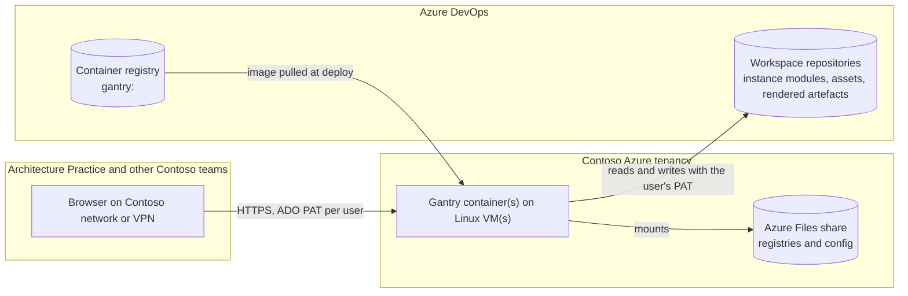

# Overview

## Overview

This SOAP proposes hosting Gantry as an internal service on Azure in the Contoso UAT and Production tenancies. Each environment runs the published Gantry container image on a Linux virtual machine with an Azure Files share mounted for persistent data. UAT is a single server. Production adds a second server behind a load balancer and a common DNS name, both servers mounting the same share, so the loss of one server does not take the service down.

In both environments every instance's data lives in an Azure DevOps workspace repository, not on the server. The share holds only the workspace registry and configuration, which keeps the servers disposable and lets two Production servers share one volume safely.

## In scope

- A UAT environment in the Contoso UAT tenancy: one Linux VM running the Gantry container, one Azure Files share, an internal DNS name.
- A Production environment in the Contoso Production tenancy: two Linux VMs running the Gantry container, one shared Azure Files share, a load balancer and a common internal DNS name.
- Network reachability from the Contoso network and VPN only. No public endpoint.
- Outbound HTTPS from the servers to Azure DevOps for workspace repositories and to the container registry for image pulls.
- A deployment path from the published container image to each environment, and phase-1 monitoring of service health. The exact mechanism for each is an open question in this SOAP (see Alternatives sketch and Open questions).
- One Azure DevOps workspace repository per environment.

## Out of scope

- **User authentication and single sign-on.** Gantry has no built-in login by design; users supply their own Azure DevOps PAT in the browser, and the network boundary controls who can reach the service. Adding SSO in front of it is a separate decision.
- **Backup and disaster recovery beyond the Azure Files share.** Instance data lives in Azure DevOps and is protected by it. The share holds only registries and configuration; cross-region replication and restore drills for it are not part of this initiative.
- Changes to Gantry the application. Anything the hosting design needs from the code is raised as its own work item.
