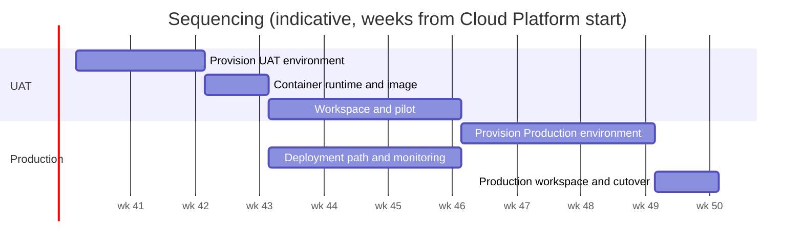

# Full SOAP Details

## Epic/Project

## Requested/lead by

Chris Barlow, Architecture Practice (requester and lead)

## Request date

10 September 2026

## Draft agreed date

Pending: to be set when the Architecture Practice agrees the draft.

## SOAP/estimate delivered date

Pending: to be set when Business Case Approved is passed.

## Sequencing

| Requirement | Team | Estimate | Notes |
| --- | --- | --- | --- |
| UAT environment (VM, share, DNS, network rules) | Cloud Platform team, Network / security team | S | Step 1. Nothing else can start until this exists. |
| Container runtime and image on the UAT VM | Cloud Platform team, Architecture Practice | S | Step 1, same engagement. Proves the image, the share mount and the proxy CA. |
| UAT workspace repository and pilot | Architecture Practice | S | Step 2. The practice authors real initiatives in UAT; sizing and the open questions are settled here. |
| Production environment (two VMs, shared share, load balancer, DNS) | Cloud Platform team, Network / security team | M | Step 3, after UAT sign-off. Load balancer choice resolved by then. |
| Deployment path and monitoring | Architecture Practice, Cloud Platform team | S | Step 3, built against UAT first and reused for Production. |
| Production workspace and cutover | Architecture Practice | S | Step 4. Production repository created, practice moves to the Production URL. |

## Caveats

- Gantry is beta software (0.2.x). Breaking changes are likely between releases and an upgrade may need a data migration step; the release changelog is the record of what changed.
- Production resilience covers the compute layer only. The Azure Files share and Azure DevOps are each a single dependency; the service is unavailable while either is.
- Sizing is unvalidated. The VM size is chosen without load data and is revisited after the UAT pilot.
- Azure DevOps access is a requirement, and anyone with access to the workspace repository can edit its instances. The audit trail is the repository's commit history.
- The load balancer, deployment and monitoring mechanisms are not decided at SOAP level; the estimate assumes the simplest option of each and grows if the HLD picks otherwise.
