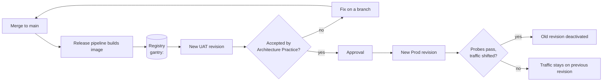
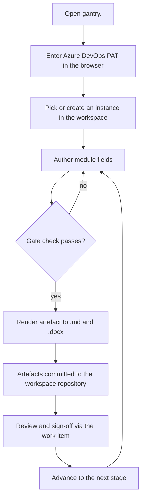
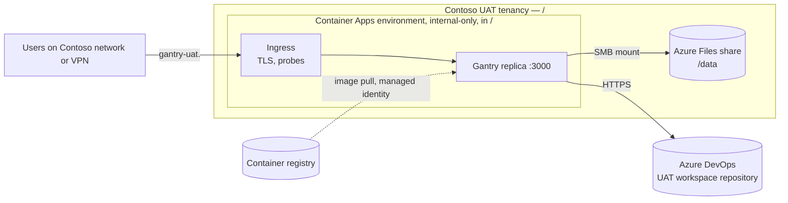
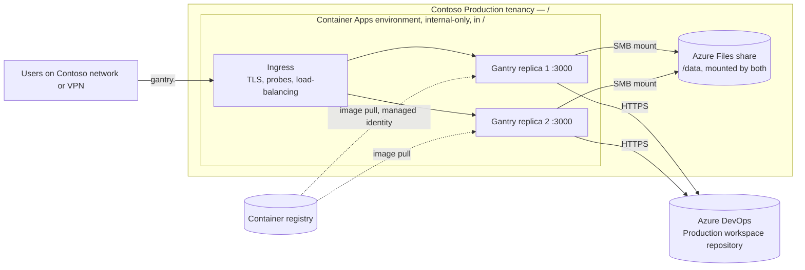

# Solution Definition

## High-level requirements

| # | Requirement | Environment |
| --- | --- | --- |
| R1 | The service is reachable only from the Contoso network and VPN; there is no public endpoint. | UAT, Prod |
| R2 | Each environment has a stable, common DNS name (`gantry-uat.<internal-domain>`, `gantry.<internal-domain>`) that does not change when a replica or revision is replaced. | UAT, Prod |
| R3 | Workspace registry and configuration survive a replica or revision being replaced: the container is disposable, the data is not. | UAT, Prod |
| R4 | Production tolerates the loss of one replica with no operator action; users keep working through the common DNS name. | Prod |
| R5 | A published image version can be deployed to UAT, exercised, and then promoted to Production unchanged, with rollback to the previous version. | UAT, Prod |
| R6 | Service health is visible to the operators without attaching to a container. | UAT, Prod |

## Process flow

Two flows matter: how a change reaches Production, and how a person uses the hosted service.

**Release and deployment.** A merge to `main` builds the container image and pushes it to the registry tagged with the version, the commit and `latest`. A pipeline stage updates the UAT container app to that image, which Container Apps rolls out as a new revision: the old revision keeps serving until the new one passes its probes, then traffic moves. The Architecture Practice exercises UAT. Once accepted, the same image tag is deployed to Production behind an approval in the same way. If a revision misbehaves, the previous revision is reactivated.

**Using Gantry.** A user opens the environment's DNS name from the Contoso network, enters their Azure DevOps PAT once in the browser, and picks or creates an instance in the workspace. They author module fields in the editor, the tool checks the current gate against the fields each artefact requires, and a Render produces the artefact as Markdown and Word documents committed back to the workspace repository. Reviewers sign off through the linked work item, and the instance moves to the next stage.

## High level solution overview

Gantry runs as its published container image in Azure Container Apps. The container listens on port 3000; the environment's ingress terminates TLS for the environment's DNS name, probes each replica's health, and spreads requests across the healthy replicas. An Azure Files share is mounted into every replica as the instances directory and holds the workspace registry and configuration; instance data itself lives in the Azure DevOps workspace repository the registry points to.

**UAT** is one container app at one replica in an internal-only environment in the Contoso UAT tenancy.

**Production** is the same design with a minimum of two replicas. Ingress owns the common DNS name, probes each replica, and stops routing to one that fails; both replicas mount the same share.

Because every user's request carries their own PAT and the replicas hold no session state, any replica can answer any request and ingress needs no session affinity. The ingress request timeout of 240 seconds is not a concern: document rendering runs in the browser, and the server's own calls are short.

## Feature breakdown and involved teams

| Feature | What it delivers | Teams |
| --- | --- | --- |
| UAT environment | Virtual network subnet, internal-only Container Apps environment, storage account and file share, Log Analytics workspace, internal DNS name and certificate | Cloud Platform team, Network / security team |
| Production environment | The same, in the Production tenancy | Cloud Platform team, Network / security team |
| Gantry container app | The published image, `GANTRY_INSTANCES_DIR=/data` on the share mount, min replicas (1 UAT, 2 Prod), HTTP probe on `/`, managed identity for registry pull, corporate CA secret volume if needed | Cloud Platform team, Architecture Practice |
| Deployment path | A pipeline stage that updates the container app's image tag as a new revision, UAT automatic and Production behind an approval; rollback by reactivating the previous revision | Architecture Practice, Cloud Platform team |
| Monitoring | Console, system and HTTP logs in Log Analytics; Azure Monitor alerts on replica restarts and failed revisions | Cloud Platform team |
| Workspace set-up | One Azure DevOps workspace repository per environment, registered in Gantry, pilot instances migrated | Architecture Practice |

## Alternatives sketch

**Linux virtual machines with a separate load balancer** was this SOAP's first proposal: one VM in UAT, two in Production behind an internal Azure Load Balancer or Application Gateway, each running the container with Docker and mounting the same Azure Files share. Rejected on engineering review. Everything the VM design assembled by hand (load balancing, health probing, restart, deployment, log collection, patching of the host) is provided by Container Apps, and the VM design left three choices open at SOAP level that Container Apps answers directly. The trade-off accepted is that Container Apps is a managed platform with less control over the host and a hard request timeout of 240 seconds, neither of which affects Gantry.

**Azure App Service for containers** would also work and is closer to a traditional web host. Not chosen because Container Apps' internal-only environment, revision model and per-replica probing map more directly onto the requirements, and the Cloud Platform team already provisions Container Apps environments.

**Azure Kubernetes Service** was set aside as far more platform than a single small web app needs.

Two smaller choices are left to the HLD and listed under Open questions: whether the Azure Files share is mounted over SMB with a storage-account key held as a Container Apps secret, or over NFS from a storage account locked to the virtual network; and whether Production runs on the Consumption workload profile or a Dedicated one.
