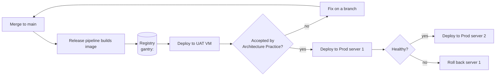
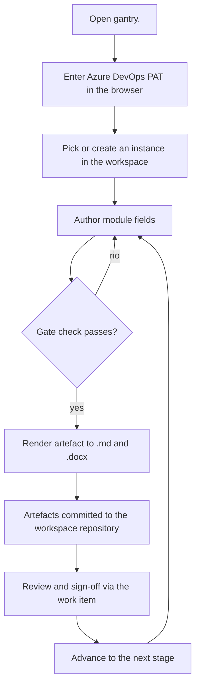
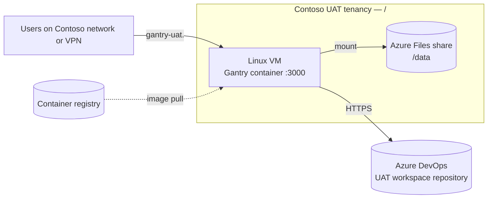
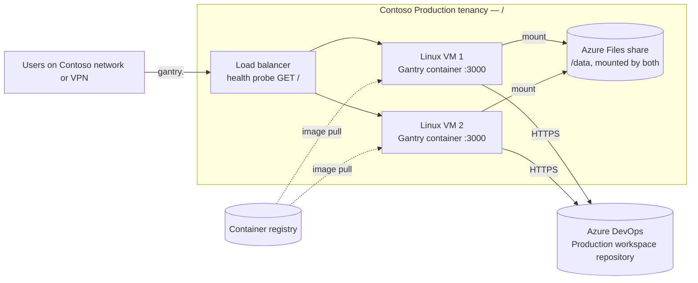

# Solution Definition

## High-level requirements

| # | Requirement | Environment |
| --- | --- | --- |
| R1 | The service is reachable only from the Contoso network and VPN; there is no public endpoint. | UAT, Prod |
| R2 | Each environment has a stable, common DNS name (`gantry-uat.<internal-domain>`, `gantry.<internal-domain>`) that does not change when a server is rebuilt. | UAT, Prod |
| R3 | Workspace registry and configuration survive a server rebuild: the container is disposable, the data is not. | UAT, Prod |
| R4 | Production tolerates the loss of one server with no operator action; users keep working through the common DNS name. | Prod |
| R5 | A published image version can be deployed to UAT, exercised, and then promoted to Production unchanged. | UAT, Prod |
| R6 | Service health is visible to the operators without logging on to a server. | UAT, Prod |

## Process flow

Two flows matter: how a change reaches Production, and how a person uses the hosted service.

**Release and deployment.** A merge to `main` builds the container image and pushes it to the registry tagged with the version, the commit and `latest`. That version is deployed to UAT and exercised by the Architecture Practice. Once accepted, the same image tag is deployed to Production, one server at a time, so the load balancer always has a healthy server to route to.

**Using Gantry.** A user opens the environment's DNS name from the Contoso network, enters their Azure DevOps PAT once in the browser, and picks or creates an instance in the workspace. They author module fields in the editor, the tool checks the current gate against the fields each artefact requires, and a Render produces the artefact as Markdown and Word documents committed back to the workspace repository. Reviewers sign off through the linked work item, and the instance moves to the next stage.

## High level solution overview

Gantry runs as its published container image on Linux virtual machines in Azure. The container listens on port 3000 and is fronted by the environment's DNS name. An Azure Files share is mounted into the container as the instances directory and holds the workspace registry and configuration; instance data itself lives in the Azure DevOps workspace repository the registry points to.

**UAT** is one server in the Contoso UAT tenancy.

**Production** is the same design with a second server. A load balancer owns the common DNS name and probes each server's health on the HTTP root; both servers mount the same share.

Because every user's requests carry their own PAT and the servers hold no session state, either Production server can answer any request, and the load balancer needs no session affinity.

## Feature breakdown and involved teams

| Feature | What it delivers | Teams |
| --- | --- | --- |
| UAT environment | One VM, one Azure Files share, resource group, internal DNS name, network rules | Cloud Platform team, Network / security team |
| Production environment | Two VMs, one shared Azure Files share, load balancer with health probe, common DNS name, network rules | Cloud Platform team, Network / security team |
| Container runtime on each VM | Docker or Podman, the Gantry image, share mounted as `/data`, restart policy, corporate CA mounted if needed | Cloud Platform team, Architecture Practice |
| Deployment path | Getting a published image tag onto the VMs, UAT first then Production (mechanism open, see below) | Architecture Practice, Cloud Platform team |
| Monitoring | Health of the container and the VM visible to operators (mechanism open, see below) | Cloud Platform team |
| Workspace set-up | One Azure DevOps workspace repository per environment, registered in Gantry, pilot instances migrated | Architecture Practice |

## Alternatives sketch

Three choices are deliberately left open at SOAP level and carried as open questions for the HLD. The options are sketched here so the estimate covers any of them.

**Load balancing in Production.** The service is internal-only, so the choice is between:

- *Azure Load Balancer (internal).* Layer 4, simplest, health probe on port 3000. TLS would terminate on each server.
- *Application Gateway (internal).* Layer 7, TLS terminated at the gateway with an internal certificate, richer health probes and request logging. More to provision and operate.
- *Azure Front Door* was considered and set aside: it is a global edge service and the wrong scale for an internal tool.

**Deploying an image to the VMs.**

- *A release stage in Azure Pipelines* that connects to each VM, pulls the tag and restarts the container, with UAT automatic and Production behind an approval. Best promotion control.
- *Automatic pull on the VM* (a watcher polling the registry for a tag). No pipeline stage, but weak control over what reaches Production and when.
- *A documented manual runbook* the operator follows. Simplest, slowest, no audit trail beyond the operator's notes.

**Monitoring.**

- *Container health plus VM metrics through Azure Monitor*, alerting when the container's own health check fails or the VM is down.
- *Load balancer health probe only*, which keeps traffic off a failed server but tells nobody.
- *Application Insights instrumentation* inside Gantry, which needs a code change and is more than phase 1 needs.
