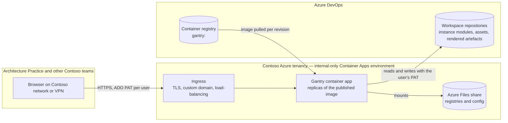

# Overview

## Overview

This SOAP proposes hosting Gantry as an internal service on **Azure Container Apps** in the Contoso UAT and Production tenancies. Each environment is one Container Apps environment, created internal-only inside a Contoso virtual network, running the published Gantry container image with an Azure Files share mounted for persistent data. UAT runs one replica. Production runs a minimum of two replicas behind the environment's built-in ingress, which load-balances across them under a common DNS name, so the loss of one replica does not take the service down and no separate load balancer is provisioned.

In both environments every instance's data lives in an Azure DevOps workspace repository, not in the container. The share holds only the workspace registry and configuration, which keeps replicas disposable and lets several replicas share one volume safely.

An earlier draft of this SOAP proposed Linux virtual machines with a separately provisioned load balancer. Engineering review pointed out that Container Apps provides the ingress, health probing, scaling, revision-based deployment and log collection that the VM design would have had to assemble by hand. The VM design is retained under Alternatives sketch as the rejected option.

## In scope

- A UAT environment in the Contoso UAT tenancy: one internal-only Container Apps environment in a Contoso virtual network, the Gantry container app at one replica, one Azure Files share, an internal DNS name and certificate.
- A Production environment in the Contoso Production tenancy: the same shape with a minimum of two replicas, so the service tolerates the loss of one.
- Network reachability from the Contoso network and VPN only. No public endpoint; the environment is created internal-only.
- Outbound HTTPS from the container app to Azure DevOps for workspace repositories and to the container registry for image pulls.
- A deployment path from the published container image to each environment as a new Container Apps revision, UAT automatically and Production behind an approval, with rollback to the previous revision.
- Phase-1 monitoring through the environment's Log Analytics workspace and Azure Monitor alerts on replica health.
- One Azure DevOps workspace repository per environment.

## Out of scope

- **User authentication and single sign-on.** Gantry has no built-in login by design; users supply their own Azure DevOps PAT in the browser, and the network boundary controls who can reach the service. Container Apps offers built-in authentication that could front the app later; turning it on is a separate decision.
- **Backup and disaster recovery beyond the Azure Files share.** Instance data lives in Azure DevOps and is protected by it. The share holds only registries and configuration; cross-region replication and restore drills for it are not part of this initiative.
- Changes to Gantry the application. Anything the hosting design needs from the code is raised as its own work item.
