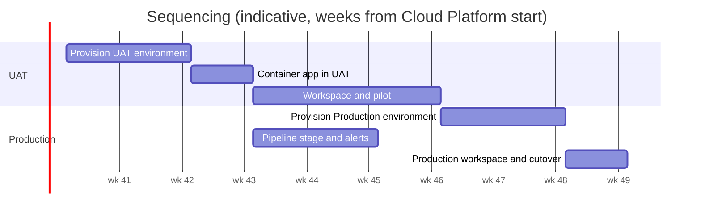

# Full SOAP Details

## Epic/Project

## Requested/lead by

Chris Barlow, Architecture Practice (requester and lead)

## Request date

10 September 2026

## Draft agreed date

Pending: to be set when the Architecture Practice agrees the draft.

## SOAP/estimate delivered date

Pending: to be set when Business Case Approved is passed.

## Sequencing

| Requirement | Team | Estimate | Notes |
| --- | --- | --- | --- |
| UAT environment (subnet, Container Apps environment, share, Log Analytics, DNS, certificate) | Cloud Platform team, Network / security team | S | Step 1. Nothing else can start until this exists. |
| Gantry container app in UAT | Cloud Platform team, Architecture Practice | S | Step 1, same engagement. Proves the image, the share mount, registry pull and the egress path. |
| UAT workspace repository and pilot | Architecture Practice | S | Step 2. The practice authors real initiatives in UAT; sizing and the open questions are settled here. |
| Production environment (same shape, two replicas) | Cloud Platform team, Network / security team | S | Step 3, after UAT sign-off. Same infrastructure-as-code as UAT with different parameters. |
| Deployment pipeline stage and alerts | Architecture Practice, Cloud Platform team | S | Step 3, built against UAT first and reused for Production. |
| Production workspace and cutover | Architecture Practice | S | Step 4. Production repository created, practice moves to the Production URL. |

## Caveats

- Gantry is beta software (0.3.x). Breaking changes are likely between releases and an upgrade may need a data migration step; the release changelog is the record of what changed.
- Production resilience covers the compute layer only. The Azure Files share and Azure DevOps are each a single dependency; the service is unavailable while either is.
- Sizing is unvalidated. The replica size and count are chosen without load data and are revisited after the UAT pilot.
- Azure DevOps access is a requirement, and anyone with access to the workspace repository can edit its instances. The audit trail is the repository's commit history.
- Container Apps is a managed platform: the host is not accessible, replicas may be moved by the platform during maintenance, and the ingress request timeout is fixed at 240 seconds. None of these affect Gantry as it works today, but a future feature that needs a long server-side request would.
- The internal-only setting on a Container Apps environment cannot be changed after creation. If a public endpoint is ever wanted, that is a new environment.
- No security scanning of the Gantry codebase or its container image is included in these estimates. The build pipeline verifies that Gantry works, not that it is free of vulnerabilities: there is no static analysis, no dependency vulnerability scan and no image scan today. Adding them is a small piece of work on the pipeline itself, but it is not sized here and the Network / security team's requirements for it are not yet known (Q7).
